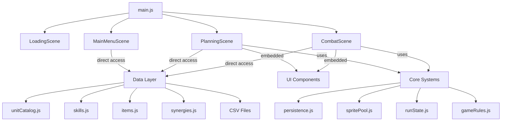
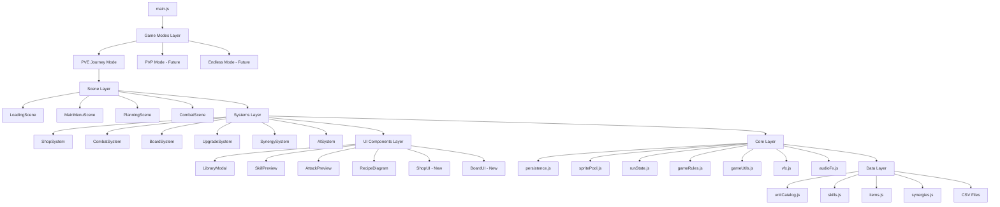
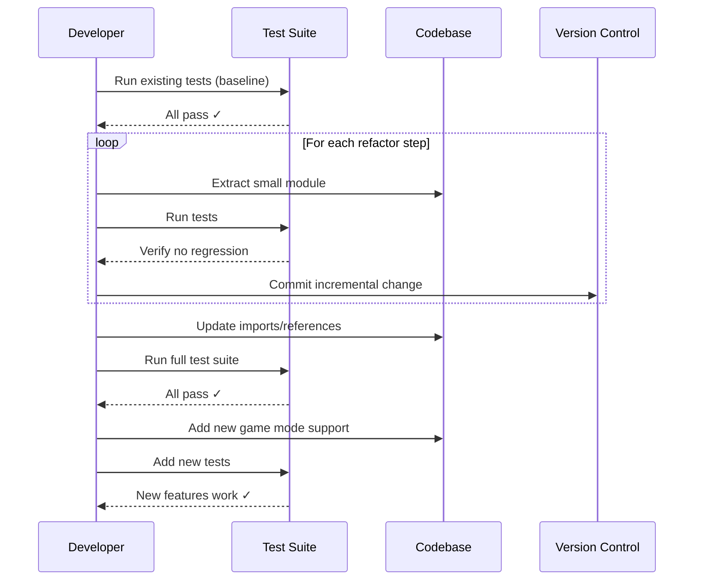

# Design Document: Code Architecture Refactor

## Overview

Đây là một refactor lớn nhằm tổ chức lại toàn bộ codebase của game Phaser 3 để hỗ trợ nhiều chế độ chơi (multiple game modes) và tạo kiến trúc mở rộng được cho tương lai. Hiện tại, code đang tập trung trong các scene lớn (MainMenuScene, PlanningScene, CombatScene) với logic game, UI, và data management lẫn lộn. Refactor này sẽ tách biệt các concerns, tạo các module có thể tái sử dụng, và thiết lập một kiến trúc rõ ràng cho việc thêm game modes mới.

Mục tiêu chính là đảm bảo không gây lỗi trong quá trình refactor bằng cách di chuyển code từng bước nhỏ, có test coverage, và maintain backward compatibility.

## Architecture

### Current Architecture (Before Refactor)



### Target Architecture (After Refactor)



### Architectural Layers

Kiến trúc mới được tổ chức thành 6 layers rõ ràng:

1. **Game Modes Layer**: Định nghĩa các chế độ chơi khác nhau
2. **Scene Layer**: Phaser scenes, chỉ chứa scene lifecycle và orchestration
3. **Systems Layer**: Business logic được tách thành các systems độc lập
4. **UI Components Layer**: Reusable UI components
5. **Core Layer**: Shared utilities, state management, effects
6. **Data Layer**: Static data, catalogs, CSV parsing

## Main Algorithm/Workflow



## Components and Interfaces

### 1. Game Mode Configuration

**Purpose**: Định nghĩa cấu hình cho từng game mode


**Interface**:
```typescript
interface GameModeConfig {
  id: string
  name: string
  description: string
  
  // Scene configuration
  scenes: string[]
  
  // Game rules
  startingGold: number
  startingHP: number
  loseCondition: LoseCondition
  
  // Systems enabled
  enabledSystems: {
    shop: boolean
    crafting: boolean
    augments: boolean
    pvp: boolean
  }
  
  // AI configuration
  aiDifficulty: "EASY" | "MEDIUM" | "HARD"
  
  // Progression rules
  goldScaling: (round: number) => number
  enemyScaling: (round: number) => number
}
```

**Responsibilities**:
- Định nghĩa rules cho từng game mode
- Cấu hình systems nào được enable
- Xác định scene flow
- Thiết lập scaling formulas

### 2. ShopSystem

**Purpose**: Quản lý logic shop (refresh, buy, sell, lock)

**Interface**:
```typescript
interface ShopSystem {
  // Shop operations
  refreshShop(player: PlayerState, cost: number): ShopOffer[]
  buyUnit(player: PlayerState, slot: number): BuyResult
  sellUnit(player: PlayerState, unit: OwnedUnit): number
  lockShop(player: PlayerState): void
  unlockShop(player: PlayerState): void
  
  // Shop generation
  generateShopOffers(level: number, round: number): ShopOffer[]
  calculateRefreshCost(player: PlayerState): number
  
  // Tier odds
  getTierOdds(level: number): TierOdds
}
```


**Responsibilities**:
- Tách toàn bộ shop logic từ PlanningScene
- Có thể reuse cho các game modes khác
- Dễ test độc lập
- Không phụ thuộc vào Phaser scene

### 3. CombatSystem

**Purpose**: Quản lý combat logic (turn order, skill execution, damage calculation)

**Interface**:
```typescript
interface CombatSystem {
  // Combat initialization
  initializeCombat(playerUnits: CombatUnit[], enemyUnits: CombatUnit[]): CombatState
  
  // Turn management
  getNextActor(state: CombatState): CombatUnit
  executeAction(state: CombatState, actor: CombatUnit): ActionResult
  
  // Skill execution
  executeSkill(caster: CombatUnit, skill: Skill, targets: CombatUnit[]): SkillResult
  
  // Damage calculation
  calculateDamage(attacker: CombatUnit, defender: CombatUnit, skill: Skill): DamageResult
  applyDamage(unit: CombatUnit, damage: number): void
  
  // Status effects
  applyStatusEffect(unit: CombatUnit, effect: StatusEffect): void
  tickStatusEffects(unit: CombatUnit): void
  
  // Combat end
  checkCombatEnd(state: CombatState): CombatEndResult
}
```

**Responsibilities**:
- Tách combat logic từ CombatScene
- Pure functions cho damage calculation (dễ test)
- Không chứa rendering logic
- Emit events cho scene để render


### 4. BoardSystem

**Purpose**: Quản lý board state và unit placement

**Interface**:
```typescript
interface BoardSystem {
  // Board operations
  placeUnit(board: Board, unit: OwnedUnit, row: number, col: number): PlaceResult
  removeUnit(board: Board, row: number, col: number): OwnedUnit | null
  moveUnit(board: Board, fromRow: number, fromCol: number, toRow: number, toCol: number): MoveResult
  
  // Board queries
  getUnitAt(board: Board, row: number, col: number): OwnedUnit | null
  getDeployedUnits(board: Board): OwnedUnit[]
  getDeployCount(board: Board): number
  canDeploy(board: Board, deployLimit: number): boolean
  
  // Board validation
  isValidPosition(row: number, col: number): boolean
  isPositionEmpty(board: Board, row: number, col: number): boolean
  
  // Synergy calculation
  calculateSynergies(units: OwnedUnit[]): SynergyResult
}
```

**Responsibilities**:
- Tách board management từ PlanningScene
- Pure functions cho board operations
- Validation logic tập trung
- Synergy calculation

### 5. UpgradeSystem

**Purpose**: Quản lý unit upgrade logic (star up, combine)

**Interface**:
```typescript
interface UpgradeSystem {
  // Upgrade operations
  canUpgrade(units: OwnedUnit[], baseId: string): boolean
  upgradeUnit(units: OwnedUnit[], baseId: string): UpgradeResult
  
  // Unit combination
  findUpgradeCandidates(units: OwnedUnit[]): UpgradeCandidate[]
  combineUnits(unit1: OwnedUnit, unit2: OwnedUnit, unit3: OwnedUnit): OwnedUnit
  
  // Equipment transfer
  transferEquipment(fromUnit: OwnedUnit, toUnit: OwnedUnit): void
}
```


**Responsibilities**:
- Tách upgrade logic từ PlanningScene
- Xử lý unit combination
- Equipment transfer logic
- Auto-upgrade detection

### 6. SynergySystem

**Purpose**: Tính toán và apply synergy bonuses

**Interface**:
```typescript
interface SynergySystem {
  // Synergy calculation
  calculateSynergies(units: OwnedUnit[]): ActiveSynergy[]
  
  // Synergy application
  applySynergiesToUnit(unit: CombatUnit, synergies: ActiveSynergy[]): void
  
  // Synergy queries
  getSynergyDescription(synergyId: string, level: number): string
  getSynergyIcon(synergyId: string): string
}
```

**Responsibilities**:
- Tách synergy logic từ nhiều nơi
- Centralized synergy calculation
- Consistent synergy application
- Reusable cho mọi game mode

### 7. AISystem

**Purpose**: Quản lý AI opponent logic

**Interface**:
```typescript
interface AISystem {
  // Enemy generation
  generateEnemyTeam(round: number, budget: number, difficulty: string): OwnedUnit[]
  
  // AI decision making
  makeAIDecision(state: CombatState, aiUnit: CombatUnit): AIAction
  
  // Difficulty scaling
  getAIDifficultyMultiplier(difficulty: string): DifficultyMultiplier
}
```

**Responsibilities**:
- Tách AI logic từ scenes
- Configurable difficulty
- Reusable enemy generation
- Testable AI behavior


## Data Models

### GameModeConfig

```typescript
interface GameModeConfig {
  id: string                    // "PVE_JOURNEY", "PVP", "ENDLESS"
  name: string                  // Display name
  description: string           // Mode description
  scenes: string[]              // Scene names to use
  startingGold: number          // Initial gold
  startingHP: number            // Initial HP
  loseCondition: LoseCondition  // Win/lose rules
  enabledSystems: {
    shop: boolean
    crafting: boolean
    augments: boolean
    pvp: boolean
  }
  aiDifficulty: "EASY" | "MEDIUM" | "HARD"
  goldScaling: (round: number) => number
  enemyScaling: (round: number) => number
}
```

**Validation Rules**:
- id must be unique
- scenes array must not be empty
- startingGold >= 0
- startingHP > 0
- All scaling functions must return positive numbers

### SystemConfig

```typescript
interface SystemConfig {
  shop?: ShopConfig
  combat?: CombatConfig
  board?: BoardConfig
  upgrade?: UpgradeConfig
  synergy?: SynergyConfig
  ai?: AIConfig
}

interface ShopConfig {
  refreshCost: number
  tierOdds: Record<number, number[]>
  maxShopSlots: number
}

interface CombatConfig {
  turnSpeed: number
  maxCombatRounds: number
  enableKnockback: boolean
  enableEvasion: boolean
}
```


**Validation Rules**:
- All numeric values must be positive
- tierOdds must sum to 100 for each level
- maxShopSlots between 3 and 7

### Board

```typescript
type Board = (OwnedUnit | null)[][]  // 5x5 grid

interface OwnedUnit {
  uid: string
  baseId: string
  star: number
  base: UnitBase
  equips: string[]
}
```

**Validation Rules**:
- Board must be 5x5
- Each cell is either null or valid OwnedUnit
- uid must be unique across all units
- star must be 1, 2, or 3
- baseId must exist in UNIT_BY_ID

### CombatState

```typescript
interface CombatState {
  playerUnits: CombatUnit[]
  enemyUnits: CombatUnit[]
  turnOrder: CombatUnit[]
  currentTurn: number
  combatLog: CombatEvent[]
  isFinished: boolean
  winner: "player" | "enemy" | null
}

interface CombatUnit {
  uid: string
  baseId: string
  star: number
  position: { row: number, col: number }
  stats: UnitStats
  currentHP: number
  currentRage: number
  statusEffects: StatusEffect[]
  isDead: boolean
}
```

**Validation Rules**:
- currentHP >= 0 and <= stats.maxHP
- currentRage >= 0 and <= 100
- position must be valid board position
- turnOrder must contain all alive units


## Algorithmic Pseudocode

### Main Refactor Algorithm

```pascal
ALGORITHM executeRefactor()
INPUT: currentCodebase
OUTPUT: refactoredCodebase

BEGIN
  // Phase 1: Preparation
  ASSERT allTestsPass(currentCodebase) = true
  backupCodebase(currentCodebase)
  createRefactorBranch()
  
  // Phase 2: Extract Systems (order matters - least dependent first)
  FOR each system IN [BoardSystem, UpgradeSystem, SynergySystem, ShopSystem, AISystem, CombatSystem] DO
    ASSERT allTestsPass(currentCodebase) = true
    
    // Extract system
    extractedSystem ← extractSystemFromScenes(system)
    createSystemFile(extractedSystem)
    
    // Update references
    updateSceneReferences(system)
    
    // Verify
    runTests()
    ASSERT allTestsPass(currentCodebase) = true
    
    commitChanges("Extract " + system.name)
  END FOR
  
  // Phase 3: Refactor Scenes
  FOR each scene IN [PlanningScene, CombatScene, MainMenuScene] DO
    ASSERT allTestsPass(currentCodebase) = true
    
    // Remove extracted logic
    cleanupScene(scene)
    
    // Use systems instead
    integrateSystemCalls(scene)
    
    // Verify
    runTests()
    ASSERT allTestsPass(currentCodebase) = true
    
    commitChanges("Refactor " + scene.name)
  END FOR
  
  // Phase 4: Add Game Mode Support
  createGameModeLayer()
  defineGameModeConfigs()
  updateMainToUseGameModes()
  
  // Final verification
  ASSERT allTestsPass(refactoredCodebase) = true
  ASSERT noRegressions(currentCodebase, refactoredCodebase) = true
  
  RETURN refactoredCodebase
END
```


**Preconditions**:
- All existing tests pass
- Codebase is in clean state (no uncommitted changes)
- Test coverage exists for critical paths

**Postconditions**:
- All existing tests still pass
- Code is organized into clear layers
- Systems are independent and reusable
- Game mode support is implemented
- No functional regressions

**Loop Invariants**:
- After each system extraction: all tests pass
- After each scene refactor: all tests pass
- Code remains runnable at every commit

### System Extraction Algorithm

```pascal
ALGORITHM extractSystemFromScenes(systemName)
INPUT: systemName (string), scenes (Scene[])
OUTPUT: extractedSystem (System)

BEGIN
  // Step 1: Identify all methods related to system
  methods ← []
  FOR each scene IN scenes DO
    sceneMethods ← findMethodsByPattern(scene, systemName)
    methods.append(sceneMethods)
  END FOR
  
  // Step 2: Analyze dependencies
  dependencies ← analyzeDependencies(methods)
  
  // Step 3: Create system interface
  systemInterface ← createInterface(methods, dependencies)
  
  // Step 4: Extract implementation
  systemImpl ← extractImplementation(methods)
  
  // Step 5: Remove Phaser dependencies
  systemImpl ← removePhaserDependencies(systemImpl)
  
  // Step 6: Make pure functions where possible
  systemImpl ← convertToPureFunctions(systemImpl)
  
  RETURN {
    interface: systemInterface,
    implementation: systemImpl,
    dependencies: dependencies
  }
END
```


**Preconditions**:
- systemName is valid system identifier
- scenes contain methods related to system
- All tests pass before extraction

**Postconditions**:
- System is extracted to separate file
- System has no Phaser dependencies
- System uses pure functions where possible
- All tests still pass

**Loop Invariants**:
- All identified methods are related to the system
- Dependencies are tracked correctly

### Shop System Extraction Example

```pascal
ALGORITHM extractShopSystem()
INPUT: PlanningScene
OUTPUT: ShopSystem

BEGIN
  // Identify shop-related methods in PlanningScene
  shopMethods ← [
    "refreshShop",
    "buyUnit", 
    "sellUnit",
    "lockShop",
    "unlockShop",
    "generateShopOffers",
    "calculateRefreshCost",
    "getTierOdds"
  ]
  
  // Extract to new file: src/systems/ShopSystem.js
  CREATE FILE "src/systems/ShopSystem.js"
  
  // Move methods (convert from scene methods to pure functions)
  FOR each method IN shopMethods DO
    // Remove 'this.' references
    pureMethod ← convertToPureFunction(method)
    
    // Add to ShopSystem
    ShopSystem[method.name] ← pureMethod
  END FOR
  
  // Update PlanningScene to use ShopSystem
  IN PlanningScene:
    REPLACE "this.refreshShop()" 
    WITH "ShopSystem.refreshShop(this.player)"
    
    REPLACE "this.buyUnit(slot)"
    WITH "ShopSystem.buyUnit(this.player, slot)"
  
  // Verify
  ASSERT allTestsPass() = true
  
  RETURN ShopSystem
END
```


## Key Functions with Formal Specifications

### Function 1: extractSystemFromScenes()

```typescript
function extractSystemFromScenes(
  systemName: string,
  scenes: Scene[]
): ExtractedSystem
```

**Preconditions:**
- `systemName` is non-empty string
- `scenes` is non-empty array of valid Scene objects
- All tests pass before extraction

**Postconditions:**
- Returns valid ExtractedSystem object
- ExtractedSystem has no Phaser dependencies
- All original functionality preserved
- All tests still pass after extraction

**Loop Invariants:** 
- For method extraction loop: All previously extracted methods are valid and tested
- For dependency analysis: All tracked dependencies are actual dependencies

### Function 2: refactorScene()

```typescript
function refactorScene(
  scene: Scene,
  systems: System[]
): RefactoredScene
```

**Preconditions:**
- `scene` is valid Phaser Scene
- `systems` is array of extracted systems
- All systems are tested and working

**Postconditions:**
- Scene only contains Phaser lifecycle and orchestration code
- Scene delegates business logic to systems
- All scene functionality preserved
- No direct data access from scene (goes through systems)

**Loop Invariants:**
- For system integration loop: Previously integrated systems work correctly


### Function 3: createGameModeConfig()

```typescript
function createGameModeConfig(
  id: string,
  config: Partial<GameModeConfig>
): GameModeConfig
```

**Preconditions:**
- `id` is unique game mode identifier
- `config` contains required fields
- All referenced scenes exist
- All scaling functions are valid

**Postconditions:**
- Returns complete GameModeConfig with defaults filled
- Config passes validation
- Config can be used to initialize game

**Loop Invariants:** N/A (no loops)

### Function 4: ShopSystem.refreshShop()

```typescript
function refreshShop(
  player: PlayerState,
  cost: number
): ShopRefreshResult
```

**Preconditions:**
- `player` is valid PlayerState object
- `player.gold >= cost`
- `cost >= 0`
- `player.level` is between 1 and 25

**Postconditions:**
- Returns new shop offers array
- `player.gold` decreased by `cost`
- Shop offers match player level tier odds
- Number of offers equals shop slot count

**Loop Invariants:**
- For offer generation loop: All generated offers are valid units from appropriate tiers


### Function 5: CombatSystem.executeAction()

```typescript
function executeAction(
  state: CombatState,
  actor: CombatUnit
): ActionResult
```

**Preconditions:**
- `state` is valid CombatState
- `actor` is in state.turnOrder
- `actor.isDead === false`
- `actor.currentRage >= 0`

**Postconditions:**
- Returns ActionResult with executed action details
- If rage >= 100: skill executed, rage reset to 0
- If rage < 100: basic attack executed, rage increased
- Combat log updated with action
- Target units affected appropriately

**Loop Invariants:**
- For target selection loop: All selected targets are valid and alive
- For damage application loop: All damage values are non-negative

## Example Usage

### Example 1: Creating a New Game Mode

```typescript
// Define new game mode configuration
const endlessMode = createGameModeConfig("ENDLESS", {
  name: "Endless Mode",
  description: "Survive as long as possible against increasingly difficult enemies",
  scenes: ["LoadingScene", "MainMenuScene", "PlanningScene", "CombatScene"],
  startingGold: 15,
  startingHP: 5,
  loseCondition: LOSE_CONDITION.NO_HEARTS,
  enabledSystems: {
    shop: true,
    crafting: true,
    augments: true,
    pvp: false
  },
  aiDifficulty: "HARD",
  goldScaling: (round) => 10 + Math.floor(round * 1.5),
  enemyScaling: (round) => Math.floor(round * 2.5)
})

// Register game mode
GameModeRegistry.register(endlessMode)

// Start game with mode
game.scene.start("MainMenuScene", { gameMode: "ENDLESS" })
```


### Example 2: Using ShopSystem in Scene

```typescript
// Before refactor (in PlanningScene)
refreshShop() {
  if (this.player.gold < 2) return
  this.player.gold -= 2
  this.player.shop = this.generateShopOffers()
  this.updateShopUI()
}

// After refactor (in PlanningScene)
refreshShop() {
  const result = ShopSystem.refreshShop(this.player, 2)
  if (result.success) {
    this.player = result.player  // Updated player state
    this.updateShopUI()
  } else {
    this.showError(result.error)
  }
}

// ShopSystem.js (pure function, easy to test)
export function refreshShop(player, cost) {
  if (player.gold < cost) {
    return { success: false, error: "Not enough gold" }
  }
  
  const newPlayer = {
    ...player,
    gold: player.gold - cost,
    shop: generateShopOffers(player.level, player.round)
  }
  
  return { success: true, player: newPlayer }
}
```

### Example 3: Using CombatSystem

```typescript
// Before refactor (in CombatScene)
executeUnitAction(unit) {
  if (unit.currentRage >= 100) {
    const skill = this.getUnitSkill(unit)
    const targets = this.findTargets(unit, skill)
    this.executeSkill(unit, skill, targets)
    unit.currentRage = 0
  } else {
    this.executeBasicAttack(unit)
    unit.currentRage += 20
  }
}

// After refactor (in CombatScene)
executeUnitAction(unit) {
  const result = CombatSystem.executeAction(this.combatState, unit)
  
  // Scene only handles rendering
  this.animateAction(result)
  this.updateUnitSprites(result.affectedUnits)
  this.updateCombatLog(result.logEntry)
}
```


### Example 4: Testing Extracted Systems

```typescript
// Easy to test without Phaser
import { ShopSystem } from '../src/systems/ShopSystem.js'

test('refreshShop deducts gold correctly', () => {
  const player = {
    gold: 10,
    level: 5,
    round: 3
  }
  
  const result = ShopSystem.refreshShop(player, 2)
  
  expect(result.success).toBe(true)
  expect(result.player.gold).toBe(8)
  expect(result.player.shop.length).toBeGreaterThan(0)
})

test('refreshShop fails with insufficient gold', () => {
  const player = {
    gold: 1,
    level: 5,
    round: 3
  }
  
  const result = ShopSystem.refreshShop(player, 2)
  
  expect(result.success).toBe(false)
  expect(result.error).toBe("Not enough gold")
})
```

## Correctness Properties

*A property is a characteristic or behavior that should hold true across all valid executions of a system—essentially, a formal statement about what the system should do. Properties serve as the bridge between human-readable specifications and machine-verifiable correctness guarantees.*

### Property 1: System Extraction Preserves Behavior

*For all* systems and test cases, extracting a system to a separate module should produce identical behavior to the original implementation.

**Validates: Requirements 1.5, 8.8, 10.4, 10.6**

### Property 2: Systems Have No Phaser Dependencies

*For all* system files, the imports should not include any Phaser framework modules.

**Validates: Requirements 1.2, 15.3**

### Property 3: Systems Only Depend on Core and Data Layers

*For all* system files, the imports should only reference modules from `src/core/` and `src/data/` directories, not other systems.

**Validates: Requirements 1.3, 15.1, 15.2**

### Property 4: Dependency Graph Is Acyclic

*For all* modules in the codebase, analyzing the import graph should reveal no circular dependencies.

**Validates: Requirements 13.6, 15.5**

### Property 5: Board Position Validation

*For any* position (row, col), placing a unit on the board should reject positions outside bounds (0-4) or positions that are already occupied.

**Validates: Requirements 2.1, 2.2, 17.6**

### Property 6: Board Query Correctness

*For any* board state and position, querying the unit at that position should return the correct unit or null.

**Validates: Requirement 2.4**

### Property 7: Deploy Count Accuracy

*For any* board state, the calculated deployed unit count should equal the number of non-null positions on the board.

**Validates: Requirement 2.5**

### Property 8: Deploy Limit Enforcement

*For any* board state and deploy limit, attempting to place a unit when the board is at capacity should be rejected.

**Validates: Requirement 2.6**

### Property 9: Synergy Calculation Correctness

*For any* set of deployed units, calculating synergies should return all active synergy bonuses based on type and class counts meeting thresholds.

**Validates: Requirements 2.7, 6.1, 6.2**

### Property 10: Shop Refresh Deducts Gold

*For any* player state with sufficient gold, refreshing the shop should decrease gold by the refresh cost.

**Validates: Requirement 3.1**

### Property 11: Shop Offers Respect Tier Odds

*For any* player level (1-25), generated shop offers should follow the tier probability distribution for that level.

**Validates: Requirements 3.2, 3.8**

### Property 12: Buy Unit Deducts Cost and Adds to Bench

*For any* valid buy operation with sufficient gold, the player's gold should decrease by unit cost and the bench should grow by one unit.

**Validates: Requirements 3.3, 3.4**

### Property 13: Buy Unit Removes Shop Offer

*For any* valid buy operation, the shop slot should become empty after purchase.

**Validates: Requirement 3.5**

### Property 14: Sell Unit Adds Gold

*For any* unit sold, the player's gold should increase by the unit's sell value.

**Validates: Requirement 3.6**

### Property 15: Shop Lock Preserves Offers

*For any* shop state, locking the shop then advancing to the next round should preserve the same shop offers.

**Validates: Requirement 3.7**

### Property 16: Insufficient Gold Errors

*For any* shop operation (refresh or buy) where player gold is less than the cost, the operation should return an error result.

**Validates: Requirements 3.9, 3.10**

### Property 17: Combat Initialization Includes All Units

*For any* set of player units and enemy units, initializing combat should create a combat state containing all provided units.

**Validates: Requirement 4.1**

### Property 18: Turn Order Based on Speed

*For any* set of combat units, the turn order should be sorted by unit speed stats in descending order.

**Validates: Requirement 4.2**

### Property 19: Skill Execution at Full Rage

*For any* combat unit with rage >= 100, executing an action should trigger skill execution and reset rage to 0.

**Validates: Requirement 4.4**

### Property 20: Basic Attack Below Full Rage

*For any* combat unit with rage < 100, executing an action should trigger basic attack and increase rage.

**Validates: Requirement 4.5**

### Property 21: Damage Calculation Includes Modifiers

*For any* attacker and defender, damage calculation should apply attack, defense, and elemental modifiers.

**Validates: Requirement 4.6**

### Property 22: HP Never Goes Below Zero

*For any* damage application, the resulting currentHP should be >= 0.

**Validates: Requirement 4.7**

### Property 23: Death Handling

*For any* unit that reaches 0 HP, the unit should be marked as dead and removed from turn order.

**Validates: Requirement 4.8**

### Property 24: Combat End Conditions

*For any* combat state where all units of one side are dead, combat should end with the appropriate winner.

**Validates: Requirements 4.9, 4.10**

### Property 25: Status Effect Ticking

*For any* combat unit with status effects, each turn should tick the status effects appropriately.

**Validates: Requirement 4.12**

### Property 26: Combat Event Logging

*For any* combat action, an event should be added to the combat log.

**Validates: Requirement 4.13**

### Property 27: Upgrade Detection

*For any* collection of units, if there are 3 units with the same baseId and star level (and star < 3), an upgrade opportunity should be detected.

**Validates: Requirement 5.1**

### Property 28: Upgrade Transformation

*For any* valid upgrade operation, 3 source units should be combined into 1 unit with star level increased by 1.

**Validates: Requirements 5.2, 5.4**

### Property 29: Equipment Transfer on Upgrade

*For any* upgrade operation, equipment from source units should be transferred to the upgraded unit.

**Validates: Requirement 5.3**

### Property 30: No Upgrade Beyond Star 3

*For any* units at star level 3, no upgrade opportunity should be detected.

**Validates: Requirement 5.5**

### Property 31: Synergy Bonus Application

*For any* unit and set of active synergies, applying synergies should apply all bonuses cumulatively.

**Validates: Requirements 6.3, 6.6**

### Property 32: AI Budget Constraint

*For any* generated enemy team, the total cost of all units should be <= the budget.

**Validates: Requirement 7.1**

### Property 33: AI Difficulty Scaling

*For any* round number, enemy team strength should scale appropriately with difficulty multipliers applied.

**Validates: Requirements 7.2, 7.3**

### Property 34: AI Team Validity

*For any* generated enemy team, all units should have unique uids and valid board positions.

**Validates: Requirement 7.7**

### Property 35: AI Strength Increases with Rounds

*For any* two consecutive rounds N and N+1, the enemy team at round N+1 should be stronger than round N.

**Validates: Requirement 7.6**

### Property 36: Scene Error Handling

*For any* system call that returns an error result, the scene should handle it appropriately (display message or take corrective action).

**Validates: Requirements 8.7, 16.4**

### Property 37: Game Mode Configuration Completeness

*For any* game mode configuration, all required fields (starting gold, HP, lose condition, enabled systems, AI difficulty, scaling functions, scenes) should be present.

**Validates: Requirements 9.2, 9.3, 9.4, 9.5, 9.6**

### Property 38: Game Mode Configuration Validation

*For any* game mode configuration being registered, validation should check completeness and reject invalid configurations.

**Validates: Requirements 9.7, 17.1, 17.2, 17.3**

### Property 39: Multiple Game Modes Support

*For all* registered game modes, the registry should support multiple modes without conflicts.

**Validates: Requirement 9.9**

### Property 40: Save Data Round Trip

*For any* game state, saving then loading should produce an equivalent state with the same format as before refactor.

**Validates: Requirements 10.2, 10.3**

### Property 41: Performance Bounds

*For any* operation, execution time should meet performance requirements: combat turn < 16ms, shop refresh < 50ms, synergy calculation < 10ms, scene transition < 100ms.

**Validates: Requirements 12.1, 12.2, 12.3, 12.4**

### Property 42: Performance Non-Regression

*For any* operation measured before and after refactor, performance should not degrade by more than 5% and memory should not increase by more than 10%.

**Validates: Requirements 12.6, 12.7**

### Property 43: Code Quality Metrics

*For all* system files, code should meet quality metrics: <= 500 lines, cyclomatic complexity <= 10, duplication < 5%.

**Validates: Requirements 13.1, 13.2, 13.3**

### Property 44: Documentation Presence

*For all* system public functions, JSDoc comments should be present with input/output types documented.

**Validates: Requirements 13.4, 13.8**

### Property 45: Naming Convention Consistency

*For all* system code, naming should follow consistent conventions (camelCase for functions, PascalCase for classes, etc.).

**Validates: Requirement 13.5**

### Property 46: Error Results for Failures

*For any* system operation that fails, the result should include a descriptive error message without throwing exceptions for expected errors.

**Validates: Requirements 16.1, 16.2**

### Property 47: Input Validation

*For any* invalid input to a system function, the function should validate and return an error result.

**Validates: Requirements 16.3, 17.4, 17.5, 17.7, 17.8**

### Property 48: Error Logging

*For any* error that occurs, an error log entry should be created for debugging.

**Validates: Requirement 16.5**

### Property 49: Graceful Failure

*For any* unexpected error, the system should fail gracefully without crashing the game.

**Validates: Requirement 16.6**

### Property 50: File Organization

*For all* files in the codebase, they should be located in the correct directory according to their layer (systems in `src/systems/`, game modes in `src/gameModes/`, tests in appropriate `tests/` subdirectories).

**Validates: Requirements 20.1, 20.2, 20.3, 20.4, 20.5, 20.6, 20.7, 20.8, 20.9**

## Error Handling

### Error Scenario 1: System Extraction Breaks Tests

**Condition**: After extracting a system, some tests fail

**Response**: 
- Immediately revert the extraction
- Analyze which tests failed and why
- Identify missing dependencies or incorrect extraction
- Re-extract with fixes
- Verify all tests pass before committing

**Recovery**:
- Use git to revert to last working state
- Review extraction algorithm
- Add more granular tests before re-attempting

### Error Scenario 2: Circular Dependencies Between Systems

**Condition**: System A depends on System B, and System B depends on System A

**Response**:
- Identify the circular dependency
- Extract common functionality to Core layer
- Refactor systems to depend on Core instead of each other
- Use dependency injection if needed

**Recovery**:
- Create shared utility in Core layer
- Update both systems to use shared utility
- Verify independence with dependency graph analysis


### Error Scenario 3: Scene Becomes Too Thin

**Condition**: After refactor, scene has almost no code and feels like unnecessary wrapper

**Response**:
- This is actually desired state for scenes
- Scenes should only orchestrate and render
- Keep scene as thin orchestration layer
- Document scene's role clearly

**Recovery**:
- N/A - this is correct architecture
- If scene truly has no purpose, consider removing it
- Otherwise, embrace thin scenes as good design

### Error Scenario 4: Performance Regression

**Condition**: After refactor, game runs slower due to function call overhead

**Response**:
- Profile to identify bottlenecks
- Optimize hot paths if needed
- Consider inlining critical functions
- Use object pooling for frequently created objects

**Recovery**:
- Measure performance before and after
- If regression > 10%, optimize hot paths
- Use performance tests to catch regressions early
- Balance clean architecture with performance needs

### Error Scenario 5: Game Mode Config Invalid

**Condition**: Developer creates game mode with invalid configuration

**Response**:
- Validate config at creation time
- Throw descriptive error with what's wrong
- Provide default values for optional fields
- Document required fields clearly

**Recovery**:
```typescript
function validateGameModeConfig(config) {
  const errors = []
  
  if (!config.id) errors.push("id is required")
  if (!config.scenes || config.scenes.length === 0) {
    errors.push("scenes array must not be empty")
  }
  if (config.startingGold < 0) {
    errors.push("startingGold must be >= 0")
  }
  
  if (errors.length > 0) {
    throw new Error(`Invalid GameModeConfig: ${errors.join(", ")}`)
  }
}
```


## Testing Strategy

### Unit Testing Approach

Mỗi system được test độc lập với pure function tests:

**Test Coverage Goals**:
- 100% coverage cho tất cả systems
- 100% coverage cho game mode configuration
- 90%+ coverage cho scenes (orchestration code)

**Key Test Cases**:

1. **ShopSystem Tests**:
   - refreshShop with sufficient gold
   - refreshShop with insufficient gold
   - buyUnit success and failure cases
   - sellUnit gold calculation
   - shop lock/unlock state
   - tier odds calculation for each level

2. **CombatSystem Tests**:
   - Turn order calculation
   - Skill execution with various targets
   - Damage calculation with all modifiers
   - Status effect application and ticking
   - Combat end detection
   - Rage gain and consumption

3. **BoardSystem Tests**:
   - Unit placement validation
   - Unit movement
   - Deploy limit enforcement
   - Synergy calculation
   - Board state queries

4. **UpgradeSystem Tests**:
   - 3-star upgrade detection
   - Unit combination
   - Equipment transfer
   - Auto-upgrade logic

5. **SynergySystem Tests**:
   - Synergy calculation for all combinations
   - Synergy bonus application
   - Multi-synergy interactions

6. **AISystem Tests**:
   - Enemy team generation for each difficulty
   - Budget-based team composition
   - AI decision making
   - Difficulty scaling


### Property-Based Testing Approach

**Property Test Library**: fast-check (JavaScript)

**Key Properties to Test**:

1. **System Extraction Preservation**:
```typescript
// Property: Extracted system behaves identically to original
fc.assert(
  fc.property(
    fc.record({
      gold: fc.integer({ min: 0, max: 1000 }),
      level: fc.integer({ min: 1, max: 25 }),
      round: fc.integer({ min: 1, max: 100 })
    }),
    (player) => {
      const resultBefore = originalRefreshShop(player)
      const resultAfter = ShopSystem.refreshShop(player, 2)
      return deepEqual(resultBefore, resultAfter)
    }
  )
)
```

2. **Idempotency Properties**:
```typescript
// Property: Calculating synergies twice gives same result
fc.assert(
  fc.property(
    fc.array(fc.record({ baseId: fc.string(), star: fc.integer(1, 3) })),
    (units) => {
      const synergies1 = SynergySystem.calculateSynergies(units)
      const synergies2 = SynergySystem.calculateSynergies(units)
      return deepEqual(synergies1, synergies2)
    }
  )
)
```

3. **Invariant Properties**:
```typescript
// Property: Gold never goes negative
fc.assert(
  fc.property(
    fc.record({
      player: fc.record({ gold: fc.integer({ min: 0, max: 100 }) }),
      cost: fc.integer({ min: 0, max: 50 })
    }),
    ({ player, cost }) => {
      const result = ShopSystem.refreshShop(player, cost)
      if (result.success) {
        return result.player.gold >= 0
      }
      return true
    }
  )
)
```


4. **Commutativity Properties**:
```typescript
// Property: Order of applying synergies doesn't matter
fc.assert(
  fc.property(
    fc.array(fc.record({ id: fc.string(), bonus: fc.integer() })),
    (synergies) => {
      const unit1 = applyInOrder(synergies)
      const unit2 = applyInOrder(shuffle(synergies))
      return unit1.stats.equals(unit2.stats)
    }
  )
)
```

5. **Boundary Properties**:
```typescript
// Property: Combat always ends within max rounds
fc.assert(
  fc.property(
    fc.record({
      playerUnits: fc.array(generateUnit(), { minLength: 1, maxLength: 15 }),
      enemyUnits: fc.array(generateUnit(), { minLength: 1, maxLength: 15 })
    }),
    ({ playerUnits, enemyUnits }) => {
      const state = CombatSystem.initializeCombat(playerUnits, enemyUnits)
      let turns = 0
      while (!state.isFinished && turns < 1000) {
        CombatSystem.executeTurn(state)
        turns++
      }
      return state.isFinished && turns < 1000
    }
  )
)
```

### Integration Testing Approach

**Integration Test Scenarios**:

1. **Full Game Flow Test**:
   - Start new game
   - Buy units from shop
   - Deploy units on board
   - Enter combat
   - Win/lose combat
   - Progress to next round
   - Verify state consistency throughout

2. **System Interaction Tests**:
   - ShopSystem + UpgradeSystem: Buy 3 units, verify auto-upgrade
   - BoardSystem + SynergySystem: Deploy units, verify synergies calculated
   - CombatSystem + SynergySystem: Combat with synergies applied correctly
   - All systems together: Complete round with all systems active

3. **Game Mode Tests**:
   - Create PVE Journey mode, verify all systems work
   - Create custom mode with different config, verify behavior changes
   - Switch between modes, verify clean state transitions


4. **Regression Tests**:
   - Run all existing tests after each refactor step
   - Compare behavior before/after for critical paths
   - Verify save/load compatibility
   - Check performance benchmarks

### Test Execution Strategy

**During Refactor**:
1. Run full test suite before starting
2. After each system extraction: run all tests
3. After each scene refactor: run all tests
4. Before each commit: run all tests
5. Use git bisect if tests fail to find breaking commit

**Continuous Testing**:
- Run tests on every file save (watch mode during development)
- Run full suite before every commit (pre-commit hook)
- Run full suite on CI/CD pipeline
- Generate coverage reports

**Test Organization**:
```
game/tests/
  systems/
    ShopSystem.test.js
    CombatSystem.test.js
    BoardSystem.test.js
    UpgradeSystem.test.js
    SynergySystem.test.js
    AISystem.test.js
  integration/
    fullGameFlow.test.js
    systemInteractions.test.js
    gameModes.test.js
  regression/
    existingTests.test.js
    behaviorComparison.test.js
  properties/
    systemExtraction.property.test.js
    invariants.property.test.js
```

## Performance Considerations

### Potential Performance Impacts

1. **Function Call Overhead**:
   - Extracting to systems adds function call overhead
   - Mitigation: Profile hot paths, inline critical functions if needed
   - Expected impact: < 5% for most operations

2. **Object Creation**:
   - Pure functions may create more intermediate objects
   - Mitigation: Use object pooling for frequently created objects
   - Reuse existing spritePool pattern


3. **Module Loading**:
   - More files means more modules to load
   - Mitigation: Use bundler (already using Vite)
   - Tree-shaking will remove unused code

4. **Memory Usage**:
   - Systems may hold references longer
   - Mitigation: Clear references when not needed
   - Use WeakMap for caches where appropriate

### Performance Optimization Strategy

1. **Measure First**:
   - Establish baseline performance metrics
   - Profile before and after refactor
   - Focus on actual bottlenecks, not theoretical ones

2. **Hot Path Optimization**:
   - Identify hot paths (combat loop, rendering)
   - Keep hot paths optimized
   - Allow cold paths (shop, menu) to prioritize clarity

3. **Lazy Loading**:
   - Load systems only when needed
   - Defer initialization until first use
   - Use dynamic imports for optional systems

4. **Caching**:
   - Cache expensive calculations (synergies, tier odds)
   - Invalidate cache when dependencies change
   - Use memoization for pure functions

### Performance Benchmarks

**Target Performance** (must maintain or improve):
- Combat turn execution: < 16ms (60 FPS)
- Shop refresh: < 50ms
- Board synergy calculation: < 10ms
- Scene transition: < 100ms
- Full game load: < 2s

**Monitoring**:
- Add performance marks for key operations
- Log slow operations in development
- Use existing performanceProfile.test.js as baseline


## Security Considerations

### Data Validation

1. **Input Validation**:
   - Validate all inputs to systems
   - Sanitize user input before processing
   - Reject invalid data early

2. **State Validation**:
   - Validate game state on load
   - Check for impossible states (negative gold, invalid positions)
   - Use existing validation in hydrateRunState as template

3. **Save Data Integrity**:
   - Maintain save data compatibility
   - Validate save data structure
   - Handle corrupted saves gracefully
   - Use existing saveDataCompatibility.test.js

### Code Security

1. **No Eval or Dynamic Code**:
   - Don't use eval() or Function() constructor
   - All code is static and bundled
   - No runtime code generation

2. **Dependency Security**:
   - Keep dependencies updated
   - Audit dependencies for vulnerabilities
   - Use npm audit regularly

3. **Client-Side Only**:
   - This is single-player client-side game
   - No server communication (no XSS/CSRF concerns)
   - No sensitive data stored

### Refactor-Specific Security

1. **Preserve Existing Validation**:
   - Don't remove validation during refactor
   - Move validation to appropriate system
   - Add tests for validation logic

2. **No Security Regressions**:
   - Maintain all existing security checks
   - Don't expose internal state unnecessarily
   - Keep data encapsulation


## Dependencies

### Existing Dependencies (Maintain)

**Core Framework**:
- Phaser 3: Game engine (scenes only, not in systems)
- Vite: Build tool and bundler

**Testing**:
- Vitest: Test runner
- fast-check: Property-based testing (already used in some tests)

**Data**:
- PapaParse: CSV parsing (in unitCatalog.js)

### New Dependencies (None Required)

Refactor uses only existing dependencies. No new external libraries needed.

### Internal Dependencies

**Systems Layer Dependencies**:
- Systems depend on: Core Layer, Data Layer
- Systems do NOT depend on: Scene Layer, UI Layer, other Systems
- Systems do NOT depend on: Phaser

**Scene Layer Dependencies**:
- Scenes depend on: Systems Layer, UI Layer, Core Layer, Phaser
- Scenes orchestrate but don't implement business logic

**UI Layer Dependencies**:
- UI components depend on: Core Layer, Data Layer, Phaser
- UI components do NOT depend on: Systems Layer, Scene Layer

**Core Layer Dependencies**:
- Core depends on: Data Layer only
- Core is foundation for everything else

**Data Layer Dependencies**:
- Data layer has NO dependencies
- Pure data and parsing logic

### Dependency Graph

```
┌─────────────────┐
│  Game Modes     │
└────────┬────────┘
         │
┌────────▼────────┐
│  Scenes         │◄──────┐
└────────┬────────┘       │
         │                │
┌────────▼────────┐   ┌───┴────┐
│  Systems        │   │   UI   │
└────────┬────────┘   └───┬────┘
         │                │
         │   ┌────────────┘
         │   │
┌────────▼───▼────┐
│  Core           │
└────────┬────────┘
         │
┌────────▼────────┐
│  Data           │
└─────────────────┘
```


## Refactor Execution Plan

### Phase 1: Preparation (1-2 days)

**Goals**: Set up for safe refactoring

**Tasks**:
1. Run full test suite, ensure 100% pass
2. Create refactor branch: `git checkout -b refactor/code-architecture`
3. Document current behavior (baseline)
4. Set up performance benchmarks
5. Review all existing tests for coverage gaps
6. Add missing tests for critical paths
7. Create rollback plan

**Success Criteria**:
- All tests pass
- Performance baseline established
- Test coverage > 80%
- Rollback plan documented

### Phase 2: Extract Systems (2-3 weeks)

**Goals**: Extract business logic into independent systems

**Order of Extraction** (least dependent first):

1. **BoardSystem** (2-3 days):
   - Extract from PlanningScene
   - Pure functions for board operations
   - No dependencies on other systems
   - Test: board operations, validation, queries

2. **UpgradeSystem** (2-3 days):
   - Extract from PlanningScene
   - Depends on BoardSystem for unit queries
   - Test: upgrade detection, combination, equipment transfer

3. **SynergySystem** (2-3 days):
   - Extract from multiple locations
   - Centralize synergy calculation
   - Test: all synergy combinations, bonus application

4. **ShopSystem** (3-4 days):
   - Extract from PlanningScene
   - Complex logic with tier odds
   - Test: refresh, buy, sell, lock, tier odds

5. **AISystem** (3-4 days):
   - Extract from CombatScene and enemy generation
   - Enemy team generation
   - Test: team generation, difficulty scaling, budget

6. **CombatSystem** (4-5 days):
   - Extract from CombatScene
   - Most complex system
   - Test: turn order, skill execution, damage, status effects

**Per-System Process**:
```
For each system:
  1. Identify all related methods (1 hour)
  2. Analyze dependencies (1 hour)
  3. Create system file with interface (2 hours)
  4. Extract implementation (4-8 hours)
  5. Remove Phaser dependencies (2-4 hours)
  6. Convert to pure functions (2-4 hours)
  7. Write unit tests (4-8 hours)
  8. Update scene to use system (2-4 hours)
  9. Run all tests (30 min)
  10. Fix any issues (2-4 hours)
  11. Code review (1 hour)
  12. Commit (30 min)
```


**Success Criteria**:
- All 6 systems extracted
- Each system has 100% test coverage
- All existing tests still pass
- Systems are independent (no circular dependencies)
- Systems have no Phaser dependencies

### Phase 3: Refactor Scenes (1-2 weeks)

**Goals**: Make scenes thin orchestration layers

**Order of Refactoring**:

1. **PlanningScene** (4-5 days):
   - Remove shop logic (use ShopSystem)
   - Remove board logic (use BoardSystem)
   - Remove upgrade logic (use UpgradeSystem)
   - Remove synergy logic (use SynergySystem)
   - Keep: UI orchestration, Phaser lifecycle, rendering
   - Test: scene integration, UI updates, user interactions

2. **CombatScene** (4-5 days):
   - Remove combat logic (use CombatSystem)
   - Remove AI logic (use AISystem)
   - Remove synergy logic (use SynergySystem)
   - Keep: Animation, rendering, UI, Phaser lifecycle
   - Test: combat flow, animations, combat end

3. **MainMenuScene** (1-2 days):
   - Already mostly UI
   - Extract any remaining game mode logic
   - Keep: Menu UI, scene transitions
   - Test: menu navigation, game start

**Per-Scene Process**:
```
For each scene:
  1. Identify what to remove (2 hours)
  2. Identify what to keep (1 hour)
  3. Replace logic with system calls (4-8 hours)
  4. Update method signatures (2 hours)
  5. Test scene integration (4 hours)
  6. Fix rendering issues (2-4 hours)
  7. Run all tests (30 min)
  8. Manual testing (2 hours)
  9. Fix any issues (2-4 hours)
  10. Code review (1 hour)
  11. Commit (30 min)
```

**Success Criteria**:
- Scenes contain only orchestration code
- No business logic in scenes
- All existing functionality works
- All tests pass
- Manual testing confirms no regressions


### Phase 4: Add Game Mode Support (1 week)

**Goals**: Enable multiple game modes

**Tasks**:

1. **Create Game Mode Layer** (2 days):
   - Create `src/gameModes/` directory
   - Create `GameModeConfig` interface
   - Create `GameModeRegistry` for registration
   - Create `PVEJourneyMode` config (current game)
   - Test: config validation, registry

2. **Update Main Entry Point** (1 day):
   - Modify `main.js` to accept game mode
   - Pass game mode to scenes
   - Initialize systems based on mode config
   - Test: game starts with mode

3. **Update Scenes for Game Modes** (2 days):
   - Scenes read config from game mode
   - Conditional system usage based on config
   - Scene flow based on mode.scenes
   - Test: scenes adapt to different modes

4. **Create Example Modes** (2 days):
   - Create `EndlessMode` config (example)
   - Create `PVPMode` config (stub for future)
   - Document how to create new modes
   - Test: switching between modes

**Success Criteria**:
- Game mode system implemented
- PVE Journey mode works (existing game)
- Example modes defined
- Documentation for creating new modes
- All tests pass

### Phase 5: Documentation & Cleanup (3-4 days)

**Goals**: Document new architecture and clean up

**Tasks**:

1. **Architecture Documentation** (1 day):
   - Document layer responsibilities
   - Document system interfaces
   - Create architecture diagrams
   - Document game mode creation process

2. **Code Documentation** (1 day):
   - Add JSDoc comments to all systems
   - Document complex algorithms
   - Add usage examples
   - Update README

3. **Cleanup** (1 day):
   - Remove dead code
   - Remove unused imports
   - Standardize naming conventions
   - Format all code

4. **Final Testing** (1 day):
   - Run full test suite
   - Manual testing of all features
   - Performance testing
   - Cross-browser testing

**Success Criteria**:
- All code documented
- Architecture documented
- No dead code
- All tests pass
- Performance meets targets


### Phase 6: Review & Merge (2-3 days)

**Goals**: Final review and merge to main

**Tasks**:

1. **Code Review** (1 day):
   - Review all changes
   - Check for code quality issues
   - Verify test coverage
   - Check documentation completeness

2. **Integration Testing** (1 day):
   - Test full game flow multiple times
   - Test all features
   - Test edge cases
   - Test error scenarios

3. **Merge Preparation** (1 day):
   - Rebase on main branch
   - Resolve any conflicts
   - Run final test suite
   - Create merge request

**Success Criteria**:
- Code review approved
- All tests pass
- No merge conflicts
- Ready to merge

### Timeline Summary

**Total Estimated Time**: 6-8 weeks

- Phase 1 (Preparation): 1-2 days
- Phase 2 (Extract Systems): 2-3 weeks
- Phase 3 (Refactor Scenes): 1-2 weeks
- Phase 4 (Game Modes): 1 week
- Phase 5 (Documentation): 3-4 days
- Phase 6 (Review & Merge): 2-3 days

**Risk Buffer**: Add 20% time for unexpected issues = 7-10 weeks total

### Rollback Strategy

**If Major Issues Occur**:

1. **Immediate Rollback**:
   - `git checkout main`
   - Abandon refactor branch
   - Investigate issues

2. **Partial Rollback**:
   - `git revert <commit>` for specific changes
   - Fix issues
   - Continue refactor

3. **Pause and Fix**:
   - Stop refactoring
   - Fix critical issues
   - Resume when stable

**Rollback Triggers**:
- More than 5 tests failing
- Performance regression > 20%
- Critical bug in production
- Unforeseen architectural issues


## File Structure After Refactor

```
game/
├── src/
│   ├── main.js                      # Entry point (updated for game modes)
│   ├── styles.css
│   │
│   ├── gameModes/                   # NEW: Game mode configurations
│   │   ├── GameModeConfig.js        # Interface and validation
│   │   ├── GameModeRegistry.js      # Mode registration
│   │   ├── PVEJourneyMode.js        # Current game mode
│   │   ├── EndlessMode.js           # Example mode
│   │   └── PVPMode.js               # Future mode (stub)
│   │
│   ├── systems/                     # NEW: Business logic systems
│   │   ├── BoardSystem.js           # Board operations
│   │   ├── UpgradeSystem.js         # Unit upgrades
│   │   ├── SynergySystem.js         # Synergy calculation
│   │   ├── ShopSystem.js            # Shop logic
│   │   ├── AISystem.js              # AI and enemy generation
│   │   └── CombatSystem.js          # Combat logic
│   │
│   ├── scenes/                      # Phaser scenes (refactored)
│   │   ├── LoadingScene.js          # (minimal changes)
│   │   ├── MainMenuScene.js         # (refactored)
│   │   ├── PlanningScene.js         # (heavily refactored)
│   │   ├── CombatScene.js           # (heavily refactored)
│   │   └── BoardPrototypeScene.js   # (may be removed)
│   │
│   ├── ui/                          # UI components (existing)
│   │   ├── LibraryModal.js
│   │   ├── SkillPreview.js
│   │   ├── AttackPreview.js
│   │   └── RecipeDiagram.js
│   │
│   ├── core/                        # Core utilities (existing)
│   │   ├── persistence.js
│   │   ├── spritePool.js
│   │   ├── runState.js
│   │   ├── gameRules.js
│   │   ├── gameUtils.js
│   │   ├── vfx.js
│   │   ├── audioFx.js
│   │   ├── tooltip.js
│   │   ├── uiSettings.js
│   │   └── sharedAssetLoader.js
│   │
│   └── data/                        # Data layer (existing)
│       ├── unitCatalog.js
│       ├── unitVisuals.js
│       ├── skills.js
│       ├── items.js
│       ├── synergies.js
│       ├── augments.js
│       └── forestBackgrounds.js
│
├── data/                            # CSV data files (existing)
│   ├── units.csv
│   ├── skills.csv
│   └── synergies.csv
│
└── tests/                           # Tests (expanded)
    ├── systems/                     # NEW: System tests
    │   ├── BoardSystem.test.js
    │   ├── UpgradeSystem.test.js
    │   ├── SynergySystem.test.js
    │   ├── ShopSystem.test.js
    │   ├── AISystem.test.js
    │   └── CombatSystem.test.js
    │
    ├── integration/                 # NEW: Integration tests
    │   ├── fullGameFlow.test.js
    │   ├── systemInteractions.test.js
    │   └── gameModes.test.js
    │
    ├── properties/                  # NEW: Property-based tests
    │   ├── systemExtraction.property.test.js
    │   └── invariants.property.test.js
    │
    └── [existing tests...]          # All existing tests remain
```


## Migration Guide for Developers

### Before Refactor

```typescript
// PlanningScene.js
class PlanningScene extends Phaser.Scene {
  refreshShop() {
    if (this.player.gold < 2) return
    this.player.gold -= 2
    
    // Complex shop generation logic here
    const tierOdds = this.getTierOdds(this.player.level)
    const offers = []
    for (let i = 0; i < 5; i++) {
      const tier = this.selectTier(tierOdds)
      const unit = this.selectUnitFromTier(tier)
      offers.push({ slot: i, baseId: unit.id })
    }
    
    this.player.shop = offers
    this.updateShopUI()
  }
  
  buyUnit(slot) {
    const offer = this.player.shop[slot]
    if (!offer) return
    
    const unit = UNIT_BY_ID[offer.baseId]
    const cost = unit.tier
    
    if (this.player.gold < cost) return
    
    this.player.gold -= cost
    this.player.bench.push(createOwnedUnit(offer.baseId))
    this.player.shop[slot] = null
    
    this.checkAutoUpgrade()
    this.updateUI()
  }
}
```

### After Refactor

```typescript
// PlanningScene.js
import { ShopSystem } from '../systems/ShopSystem.js'
import { UpgradeSystem } from '../systems/UpgradeSystem.js'

class PlanningScene extends Phaser.Scene {
  refreshShop() {
    const result = ShopSystem.refreshShop(this.player, 2)
    
    if (result.success) {
      this.player = result.player
      this.updateShopUI()
    } else {
      this.showError(result.error)
    }
  }
  
  buyUnit(slot) {
    const result = ShopSystem.buyUnit(this.player, slot)
    
    if (result.success) {
      this.player = result.player
      
      // Check for auto-upgrade
      const upgradeResult = UpgradeSystem.checkAutoUpgrade(this.player.bench)
      if (upgradeResult.upgraded) {
        this.player.bench = upgradeResult.bench
        this.showUpgradeAnimation(upgradeResult.unit)
      }
      
      this.updateUI()
    } else {
      this.showError(result.error)
    }
  }
}

// systems/ShopSystem.js
export function refreshShop(player, cost) {
  if (player.gold < cost) {
    return { success: false, error: "Not enough gold" }
  }
  
  const newPlayer = {
    ...player,
    gold: player.gold - cost,
    shop: generateShopOffers(player.level, player.round)
  }
  
  return { success: true, player: newPlayer }
}

export function buyUnit(player, slot) {
  const offer = player.shop[slot]
  if (!offer) {
    return { success: false, error: "No unit in slot" }
  }
  
  const unit = UNIT_BY_ID[offer.baseId]
  const cost = unit.tier
  
  if (player.gold < cost) {
    return { success: false, error: "Not enough gold" }
  }
  
  const newPlayer = {
    ...player,
    gold: player.gold - cost,
    bench: [...player.bench, createOwnedUnit(offer.baseId)],
    shop: player.shop.map((o, i) => i === slot ? null : o)
  }
  
  return { success: true, player: newPlayer }
}
```


### Key Differences

1. **Scene Responsibility**:
   - Before: Scene contains all logic
   - After: Scene only orchestrates and renders

2. **State Management**:
   - Before: Direct mutation of `this.player`
   - After: Systems return new state, scene updates

3. **Testability**:
   - Before: Must mock Phaser to test
   - After: Pure functions, easy to test

4. **Reusability**:
   - Before: Logic tied to specific scene
   - After: Systems reusable across game modes

5. **Error Handling**:
   - Before: Silent failures or inline checks
   - After: Explicit success/error results

### Adding a New Game Mode

```typescript
// 1. Create game mode config
// src/gameModes/CustomMode.js
import { createGameModeConfig } from './GameModeConfig.js'
import { LOSE_CONDITION } from '../core/gameRules.js'

export const CustomMode = createGameModeConfig("CUSTOM", {
  name: "Custom Mode",
  description: "Your custom game mode",
  scenes: ["LoadingScene", "MainMenuScene", "PlanningScene", "CombatScene"],
  startingGold: 20,
  startingHP: 5,
  loseCondition: LOSE_CONDITION.NO_HEARTS,
  enabledSystems: {
    shop: true,
    crafting: false,  // Disable crafting
    augments: true,
    pvp: false
  },
  aiDifficulty: "MEDIUM",
  goldScaling: (round) => 10 + round * 2,
  enemyScaling: (round) => round * 3
})

// 2. Register mode
// src/gameModes/GameModeRegistry.js
import { CustomMode } from './CustomMode.js'

GameModeRegistry.register(CustomMode)

// 3. Use mode
// In MainMenuScene
startGame() {
  this.scene.start("PlanningScene", { 
    gameMode: "CUSTOM" 
  })
}

// 4. Scenes automatically adapt
// In PlanningScene
create() {
  const config = GameModeRegistry.get(this.gameMode)
  
  // Conditionally show crafting UI
  if (config.enabledSystems.crafting) {
    this.showCraftingUI()
  }
  
  // Use mode-specific scaling
  this.goldPerRound = config.goldScaling(this.player.round)
}
```


## Risk Assessment

### High Risk Areas

1. **CombatScene Refactor**:
   - Risk: Most complex scene with animations, timing, state
   - Mitigation: Extract in small pieces, test thoroughly, keep animations separate
   - Fallback: Keep combat logic in scene if extraction too risky

2. **Save Data Compatibility**:
   - Risk: Refactor breaks existing saves
   - Mitigation: Maintain exact same save format, test with existing saves
   - Fallback: Add migration logic if format must change

3. **Performance Regression**:
   - Risk: Function call overhead slows game
   - Mitigation: Profile before/after, optimize hot paths
   - Fallback: Inline critical functions if needed

4. **Test Coverage Gaps**:
   - Risk: Missing tests don't catch regressions
   - Mitigation: Add tests before refactoring, aim for 90%+ coverage
   - Fallback: Manual testing for uncovered areas

### Medium Risk Areas

1. **Circular Dependencies**:
   - Risk: Systems depend on each other
   - Mitigation: Extract in dependency order, use Core for shared code
   - Fallback: Refactor to remove circular dependency

2. **UI Component Integration**:
   - Risk: UI components break when scenes change
   - Mitigation: Keep UI component interfaces stable
   - Fallback: Update UI components if needed

3. **Phaser Version Compatibility**:
   - Risk: Refactor exposes Phaser API issues
   - Mitigation: Test with current Phaser version
   - Fallback: Update Phaser if needed

### Low Risk Areas

1. **Data Layer**:
   - Risk: Minimal, data layer already separate
   - Mitigation: Don't change data layer
   - Fallback: N/A

2. **Core Utilities**:
   - Risk: Minimal, already well-structured
   - Mitigation: Minimal changes to core
   - Fallback: N/A

3. **LoadingScene**:
   - Risk: Minimal, simple scene
   - Mitigation: Minimal or no changes
   - Fallback: N/A


## Success Metrics

### Functional Metrics

1. **Test Pass Rate**: 100% of existing tests pass
2. **Feature Parity**: All existing features work identically
3. **Save Compatibility**: Old saves load correctly
4. **No Crashes**: No new crashes or errors

### Code Quality Metrics

1. **Test Coverage**: > 90% for systems, > 80% overall
2. **Code Duplication**: < 5% duplicated code
3. **Cyclomatic Complexity**: Average < 10 per function
4. **File Size**: No file > 500 lines (except scenes during transition)

### Architecture Metrics

1. **System Independence**: 0 circular dependencies
2. **Layer Separation**: Systems have 0 Phaser dependencies
3. **Pure Functions**: > 80% of system functions are pure
4. **Reusability**: Systems can be used in multiple game modes

### Performance Metrics

1. **Combat Turn**: < 16ms (maintain 60 FPS)
2. **Shop Refresh**: < 50ms
3. **Scene Transition**: < 100ms
4. **Load Time**: < 2s
5. **Memory Usage**: No increase > 10%

### Developer Experience Metrics

1. **Build Time**: No increase > 20%
2. **Test Run Time**: No increase > 30%
3. **Hot Reload Time**: No increase > 50%
4. **Documentation**: 100% of public APIs documented

### Timeline Metrics

1. **On Schedule**: Complete within 8-10 weeks
2. **No Major Rollbacks**: < 2 rollbacks during refactor
3. **Incremental Progress**: Commit every 1-2 days
4. **Review Time**: < 2 days per phase review


## Conclusion

Đây là một refactor lớn và quan trọng nhằm tạo nền tảng vững chắc cho sự phát triển tương lai của game. Bằng cách tách biệt concerns, tạo các systems độc lập, và thiết lập kiến trúc rõ ràng, chúng ta sẽ có:

1. **Khả năng mở rộng**: Dễ dàng thêm game modes mới
2. **Khả năng bảo trì**: Code rõ ràng, dễ hiểu, dễ sửa
3. **Khả năng test**: Systems độc lập, dễ test
4. **Khả năng tái sử dụng**: Logic có thể dùng lại giữa các modes
5. **Chất lượng code**: Kiến trúc tốt, ít bugs, dễ review

Refactor sẽ được thực hiện từng bước nhỏ, với test coverage đầy đủ, và rollback plan rõ ràng để đảm bảo an toàn. Mỗi commit đều giữ code ở trạng thái runnable, và mọi thay đổi đều được verify bằng tests.

Kết quả cuối cùng sẽ là một codebase sạch, có tổ chức tốt, và sẵn sàng cho việc phát triển các tính năng mới trong tương lai.

---

**Document Version**: 1.0  
**Created**: 2024  
**Status**: Design Complete - Ready for Requirements Derivation
