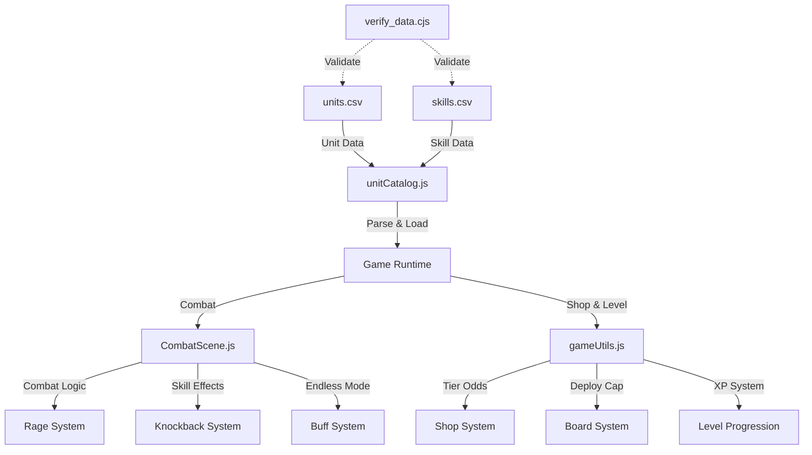
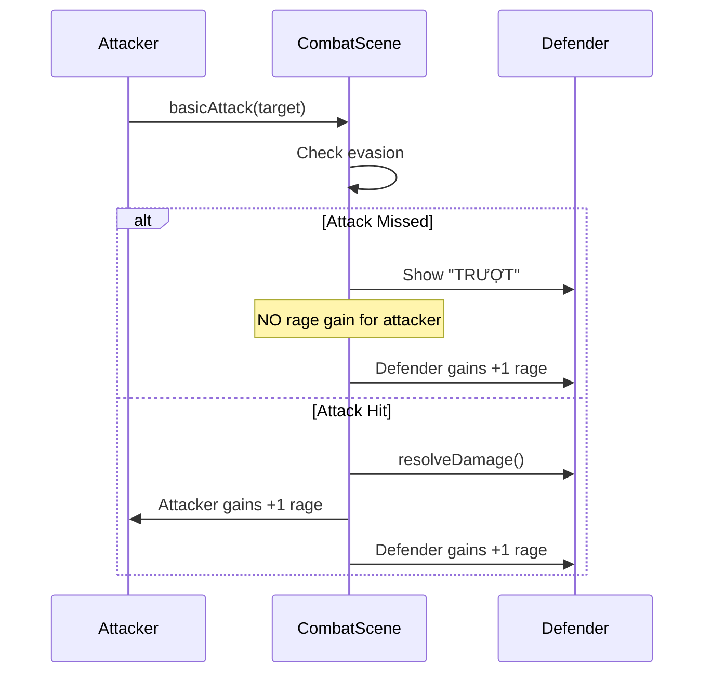
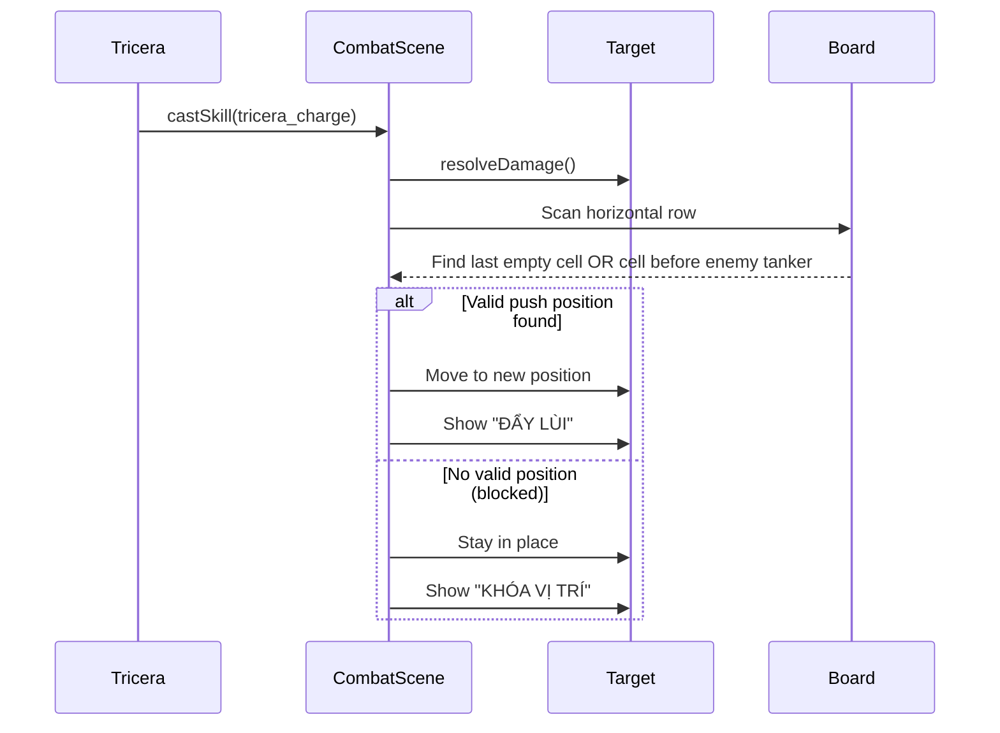

# Design Document: Đại tu và Cân bằng Game Bá Chủ Khu Rừng

## Overview

Dự án "Đại tu và Cân bằng Game Bá Chủ Khu Rừng" (Forest Lord Overhaul) là một bản cập nhật toàn diện nhằm sửa lỗi các cơ chế cốt lõi, cân bằng lại hệ thống đơn vị, và mở rộng nội dung game từ 50 lên 120 linh thú. Dự án tập trung vào 4 trụ cột chính:

1. **Sửa lỗi cơ chế cốt lõi**: Hồi Nộ (Rage) khi đánh hụt (Miss), Đẩy lùi (Knockback) của Tê giác, và Buff Vô tận (Endless) không mong muốn
2. **Làm lại và cân bằng đơn vị**: Điều chỉnh role, kỹ năng và giá trị của Wolf, Mosquito, Fox, Leopard
3. **Mở rộng 120 tướng**: Tăng từ ~50 lên 120 linh thú với 6 roles × 5 tiers × 4 units/tier
4. **Cân bằng độ khó & Hệ thống**: Tăng deploy cap lên 25, xóa giới hạn cấp độ, điều chỉnh độ khó Easy mode

Thiết kế này kết hợp cả kiến trúc cấp cao (components, data flow) và thuật toán cấp thấp (logic cụ thể) để đảm bảo tính nhất quán và khả năng bảo trì.

## Architecture



## Sequence Diagrams

### Combat Flow with Rage Fix



### Knockback Fix Flow



## Components and Interfaces

### Component 1: Rage System (CombatScene.js)

**Purpose**: Quản lý hệ thống tích lũy Nộ (Rage/Mana) cho các đơn vị trong combat

**Interface**:
```javascript
// In resolveDamage() method
resolveDamage(attacker, defender, rawDamage, damageType, reason, options = {}) {
  // ... damage calculation ...
  
  // Rage gain logic
  if (attacker && !options.noRage && damageDealt > 0) {
    const gain = attacker.side === "RIGHT" ? this.getAI().rageGain : 1;
    attacker.rage = Math.min(attacker.rageMax, attacker.rage + gain);
  }
  if (!options.noRage) {
    defender.rage = Math.min(defender.rageMax, defender.rage + 1);
  }
}
```

**Responsibilities**:
- Tính toán rage gain cho attacker chỉ khi đòn đánh thực sự gây sát thương (không Miss)
- Defender luôn nhận rage khi bị tấn công (kể cả khi Miss)
- Xử lý rage gain khác nhau cho player (LEFT) và AI (RIGHT)

**Current Bug**: Attacker nhận rage ngay cả khi đòn đánh Miss (evasion check trả về 0 damage)

**Fix Required**: Chỉ cộng rage cho attacker khi `damageDealt > 0` (sau khi trừ evasion)

### Component 2: Knockback System (CombatScene.js)

**Purpose**: Xử lý hiệu ứng đẩy lùi của kỹ năng tricera_charge

**Interface**:
```javascript
// In applySkillEffect() method, case "knockback_charge"
case "knockback_charge": {
  this.resolveDamage(attacker, target, rawSkill, skill.damageType, skill.name, skillOpts);
  if (target.alive) {
    const pushDirection = attacker.side === "LEFT" ? 1 : -1;
    const targetPosition = this.findKnockbackPosition(target, pushDirection, enemies);
    
    if (targetPosition !== target.col) {
      target.col = targetPosition;
      await this.tweenCombatUnit(target, screen.x, screen.y - 10, 220);
      this.showFloatingText(screen.x, screen.y - 45, "ĐẨY LÙI", "#ffffff");
    } else {
      this.showFloatingText(target.sprite.x, target.sprite.y - 45, "KHÓA VỊ TRÍ", "#c8d5e6");
    }
  }
}

// New helper method
findKnockbackPosition(target, direction, enemies) {
  // Scan horizontal row to find last empty cell or cell before enemy tanker
  // Returns new column position
}
```

**Responsibilities**:
- Quét hàng ngang (row) theo hướng đẩy để tìm vị trí hợp lệ
- Ưu tiên: ô trống cuối cùng HOẶC ô ngay trước tanker địch
- Tránh đẩy ngược (pull) hoặc đẩy vào vị trí không hợp lý

**Current Bug**: Logic hiện tại chỉ đẩy 1 ô và dễ bị block, không tìm vị trí tối ưu

**Fix Required**: Implement thuật toán quét hàng ngang thông minh

### Component 3: Endless Buff System (CombatScene.js)

**Purpose**: Quản lý các buff đặc biệt trong chế độ Endless

**Interface**:
```javascript
// In processStartTurn() or applySynergyBonuses()
applyEndlessBuff(unit, round) {
  if (this.player.gameMode !== "ENDLESS") return;
  
  // Remove player healing buff
  // Keep enemy scaling buffs only
  if (unit.side === "RIGHT") {
    // AI buffs: HP, ATK, MATK scaling
    const scaleFactor = 1 + (round - 30) * 0.05;
    unit.hp *= scaleFactor;
    unit.atk *= scaleFactor;
    unit.matk *= scaleFactor;
  }
  // NO healing for player units
}
```

**Responsibilities**:
- Loại bỏ hiệu ứng "Hồi máu người chơi" trong Endless mode
- Giữ nguyên các buff tăng sức mạnh cho AI
- Đảm bảo độ khó tăng dần theo vòng

**Current Bug**: Player units nhận healing buff không mong muốn trong Endless mode

**Fix Required**: Remove player healing logic, chỉ giữ AI scaling

### Component 4: Unit Catalog (unitCatalog.js)

**Purpose**: Parse và quản lý dữ liệu 120 linh thú từ units.csv

**Interface**:
```javascript
// Remove generateExtraUnits() logic
export function loadUnitCatalog() {
  const units = parseUnitsCSV(); // Read from units.csv
  // NO dynamic generation
  return units; // Should return exactly 120 units
}

// Validation
export function validateUnitCatalog(units) {
  const expectedCount = 120;
  const roles = ['TANKER', 'FIGHTER', 'ASSASSIN', 'ARCHER', 'MAGE', 'SUPPORT'];
  const tiers = [1, 2, 3, 4, 5];
  
  // Check: 6 roles × 5 tiers × 4 units = 120
  // Check: Unique names and emojis
  // Check: No duplicate IDs
}
```

**Responsibilities**:
- Load chính xác 120 units từ CSV
- Validate cấu trúc: 6 roles × 5 tiers × 4 units/tier
- Đảm bảo tên và emoji duy nhất
- Loại bỏ logic generateExtraUnits

### Component 5: Game Progression System (gameUtils.js)

**Purpose**: Quản lý hệ thống cấp độ, tier odds, và deploy cap

**Interface**:
```javascript
// Extended tier odds up to level 25+
const TIER_ODDS_BY_LEVEL = {
  1: [1, 0, 0, 0, 0],
  2: [0.8, 0.2, 0, 0, 0],
  // ... existing levels ...
  9: [0.08, 0.12, 0.2, 0.3, 0.3],
  10: [0.05, 0.1, 0.2, 0.3, 0.35],
  // ... up to level 25
  25: [0, 0.02, 0.08, 0.2, 0.7]
};

// Extended XP requirements
const XP_TO_LEVEL_UP = {
  1: 2, 2: 4, 3: 6, 4: 10, 5: 16, 6: 24, 7: 36, 8: 52,
  9: 70, 10: 90, 11: 112, 12: 136, 13: 162, 14: 190,
  // ... up to level 25
};

// Increased deploy cap
export function getDeployCapByLevel(level) {
  return clamp(level + 2, 3, 25); // Max 25 (full 5×5 board)
}
```

**Responsibilities**:
- Mở rộng TIER_ODDS_BY_LEVEL hỗ trợ đến cấp 25+
- Mở rộng XP_TO_LEVEL_UP cho progression dài hơn
- Tăng deploy cap tối đa lên 25 (full bàn cờ 5×5)
- Xóa giới hạn cấp độ cứng

## Data Models

### Model 1: Unit (units.csv)

```javascript
interface Unit {
  id: string;              // Unique identifier (e.g., "bear_ancient")
  name: string;            // Display name (Vietnamese)
  species: string;         // Species key for merging
  icon: string;            // Emoji icon
  tribe: string;           // STONE, TIDE, WIND, FIRE, SWARM, NIGHT, SPIRIT, WOOD
  tribeVi: string;         // Vietnamese tribe name
  classType: string;       // TANKER, FIGHTER, ASSASSIN, ARCHER, MAGE, SUPPORT
  classVi: string;         // Vietnamese class name
  tier: number;            // 1-5 (cost in gold)
  hp: number;              // Base HP
  atk: number;             // Base ATK
  def: number;             // Base DEF
  matk: number;            // Base MATK
  mdef: number;            // Base MDEF
  range: number;           // Attack range (1=melee, 4=ranged)
  rageMax: number;         // Max rage/mana
  skillId: string;         // Reference to skills.csv
}
```

**Validation Rules**:
- Total count must be exactly 120
- Each role must have exactly 20 units (4 per tier × 5 tiers)
- All IDs must be unique
- All name + icon combinations must be unique
- tier must be 1-5
- skillId must reference valid skill in skills.csv

### Model 2: Skill (skills.csv)

```javascript
interface Skill {
  id: string;              // Unique identifier
  name: string;            // Display name
  descriptionVi: string;   // Vietnamese description
  actionPattern: string;   // MELEE_FRONT, RANGED_STATIC, ASSASSIN_BACK, SELF
  effect: string;          // Effect type (e.g., "knockback_charge")
  damageType: string;      // physical, magic, true
  base: number;            // Base damage
  scaleStat: string;       // atk, matk, def, etc.
  scale: number;           // Scaling multiplier
  // ... other effect parameters
}
```

**Validation Rules**:
- All skill IDs referenced in units.csv must exist
- effect must be valid effect type
- damageType must be: physical, magic, or true
- scaleStat must be valid stat name

### Model 3: Unit Balance Changes

```javascript
// Wolf: FIGHTER → ASSASSIN
{
  id: "wolf_alpha",
  classType: "ASSASSIN",  // Changed from FIGHTER
  classVi: "Sát thủ",     // Changed from Đấu sĩ
  // Stats adjusted for assassin role
  hp: 280,                // Reduced from 325
  atk: 72,                // Increased from 64
  def: 16,                // Reduced from 21
}

// Mosquito: Add max HP increase on drain
{
  id: "mosquito_toxic",
  skillId: "mosquito_drain_v2",  // New skill version
}

// Fox: +1 gold on kill with skill
{
  id: "fox_flame",
  skillId: "flame_combo_v2",  // New skill version with gold reward
}

// Leopard: Move to Tier 5
{
  id: "panther_void",
  tier: 5,                // Changed from 2
  hp: 320,                // Buffed stats
  atk: 95,                // Buffed stats
  // Skill: Rage refund or extra attack on kill
}
```

### Model 4: Game Progression Config

```javascript
interface ProgressionConfig {
  tierOddsByLevel: Record<number, number[]>;  // Level 1-25+
  xpToLevelUp: Record<number, number>;        // Level 1-25+
  deployCapByLevel: (level: number) => number; // Max 25
  easyModeDifficultyStart: number;            // Round 30+
}
```

**Validation Rules**:
- tierOddsByLevel must sum to 1.0 for each level
- xpToLevelUp must be monotonically increasing
- deployCapByLevel max must be 25 (5×5 board)
- easyModeDifficultyStart must be >= 30

## Algorithmic Pseudocode

### Algorithm 1: Rage Gain Fix

```javascript
ALGORITHM fixRageGainOnMiss(attacker, defender, rawDamage, damageType, options)
INPUT: attacker (Unit), defender (Unit), rawDamage (number), damageType (string), options (object)
OUTPUT: actualDamage (number)

BEGIN
  // Step 1: Check evasion BEFORE damage calculation
  IF attacker exists AND NOT options.forceHit AND NOT options.isSkill THEN
    evadeChance ← clamp(defender.mods.evadePct, 0, 0.6)
    
    IF random() < evadeChance THEN
      // Attack missed - NO rage for attacker
      showFloatingText(defender, "TRƯỢT")
      
      // Defender still gains rage (was attacked)
      defender.rage ← min(defender.rageMax, defender.rage + 1)
      
      RETURN 0  // No damage dealt
    END IF
  END IF
  
  // Step 2: Calculate damage (existing logic)
  actualDamage ← calculateDamage(rawDamage, damageType, defender)
  
  // Step 3: Apply damage
  damageDealt ← applyDamageToUnit(defender, actualDamage)
  
  // Step 4: Rage gain ONLY if damage was dealt
  IF attacker exists AND NOT options.noRage AND damageDealt > 0 THEN
    rageGain ← (attacker.side === "RIGHT") ? AI.rageGain : 1
    attacker.rage ← min(attacker.rageMax, attacker.rage + rageGain)
  END IF
  
  // Step 5: Defender always gains rage when taking damage
  IF NOT options.noRage AND damageDealt > 0 THEN
    defender.rage ← min(defender.rageMax, defender.rage + 1)
  END IF
  
  RETURN damageDealt
END
```

**Preconditions**:
- attacker and defender are valid Unit objects
- rawDamage >= 0
- damageType is one of: "physical", "magic", "true"

**Postconditions**:
- Attacker gains rage if and only if damageDealt > 0
- Defender gains rage if damageDealt > 0
- Return value equals actual damage dealt (0 if missed)

**Loop Invariants**: N/A (no loops)

### Algorithm 2: Knockback Position Finding

```javascript
ALGORITHM findKnockbackPosition(target, pushDirection, enemies, boardWidth)
INPUT: target (Unit), pushDirection (number: +1 or -1), enemies (Unit[]), boardWidth (number)
OUTPUT: newColumn (number)

BEGIN
  currentCol ← target.col
  currentRow ← target.row
  
  // Step 1: Determine scan range based on push direction
  IF pushDirection > 0 THEN
    // Pushing right (player attacking)
    scanStart ← currentCol + 1
    scanEnd ← boardWidth - 1
    scanStep ← 1
  ELSE
    // Pushing left (enemy attacking)
    scanStart ← currentCol - 1
    scanEnd ← 0
    scanStep ← -1
  END IF
  
  // Step 2: Scan for last empty cell or cell before tanker
  lastEmptyCol ← currentCol  // Default: no movement
  foundTankerCol ← null
  
  FOR col FROM scanStart TO scanEnd STEP scanStep DO
    // Check if cell is occupied
    occupant ← findUnitAt(enemies, currentRow, col)
    
    IF occupant IS NULL THEN
      // Empty cell found
      lastEmptyCol ← col
    ELSE
      // Cell occupied - check if it's a tanker
      IF occupant.classType === "TANKER" THEN
        foundTankerCol ← col
        BREAK  // Stop scanning
      ELSE
        // Non-tanker blocking - stop here
        BREAK
      END IF
    END IF
  END FOR
  
  // Step 3: Determine final position
  IF foundTankerCol IS NOT NULL THEN
    // Push to cell before tanker
    IF pushDirection > 0 THEN
      newColumn ← foundTankerCol - 1
    ELSE
      newColumn ← foundTankerCol + 1
    END IF
  ELSE
    // Push to last empty cell found
    newColumn ← lastEmptyCol
  END IF
  
  // Step 4: Validate position is within bounds and different from current
  newColumn ← clamp(newColumn, 0, boardWidth - 1)
  
  IF newColumn === currentCol THEN
    // No valid movement
    RETURN currentCol
  END IF
  
  RETURN newColumn
END
```

**Preconditions**:
- target is a valid Unit with row and col properties
- pushDirection is either +1 (right) or -1 (left)
- enemies is an array of Unit objects
- boardWidth > 0 (typically 10)

**Postconditions**:
- Returns valid column index within [0, boardWidth-1]
- Returns currentCol if no valid push position exists
- Prioritizes cell before tanker over last empty cell

**Loop Invariants**:
- lastEmptyCol always contains a valid column index
- All cells between scanStart and current col have been checked

### Algorithm 3: Unit Catalog Validation

```javascript
ALGORITHM validateUnitCatalog(units)
INPUT: units (Unit[]) - Array of units loaded from CSV
OUTPUT: validationResult (object with isValid boolean and errors array)

BEGIN
  errors ← []
  
  // Check 1: Total count must be 120
  IF units.length !== 120 THEN
    errors.push("Expected 120 units, found " + units.length)
  END IF
  
  // Check 2: Count by role and tier
  roleCounts ← {}
  tierCounts ← {}
  roleTierMatrix ← {}  // [role][tier] = count
  
  FOR EACH unit IN units DO
    // Count by role
    IF roleCounts[unit.classType] IS NULL THEN
      roleCounts[unit.classType] ← 0
    END IF
    roleCounts[unit.classType] ← roleCounts[unit.classType] + 1
    
    // Count by tier
    IF tierCounts[unit.tier] IS NULL THEN
      tierCounts[unit.tier] ← 0
    END IF
    tierCounts[unit.tier] ← tierCounts[unit.tier] + 1
    
    // Count by role-tier combination
    key ← unit.classType + "_" + unit.tier
    IF roleTierMatrix[key] IS NULL THEN
      roleTierMatrix[key] ← 0
    END IF
    roleTierMatrix[key] ← roleTierMatrix[key] + 1
  END FOR
  
  // Check 3: Each role must have exactly 20 units
  expectedRoles ← ["TANKER", "FIGHTER", "ASSASSIN", "ARCHER", "MAGE", "SUPPORT"]
  FOR EACH role IN expectedRoles DO
    IF roleCounts[role] !== 20 THEN
      errors.push(role + " has " + roleCounts[role] + " units, expected 20")
    END IF
  END FOR
  
  // Check 4: Each role-tier combination must have exactly 4 units
  FOR EACH role IN expectedRoles DO
    FOR tier FROM 1 TO 5 DO
      key ← role + "_" + tier
      count ← roleTierMatrix[key] ?? 0
      IF count !== 4 THEN
        errors.push(role + " tier " + tier + " has " + count + " units, expected 4")
      END IF
    END FOR
  END FOR
  
  // Check 5: Unique IDs
  idSet ← new Set()
  FOR EACH unit IN units DO
    IF idSet.contains(unit.id) THEN
      errors.push("Duplicate ID: " + unit.id)
    END IF
    idSet.add(unit.id)
  END FOR
  
  // Check 6: Unique name + icon combinations
  nameIconSet ← new Set()
  FOR EACH unit IN units DO
    combo ← unit.name + "|" + unit.icon
    IF nameIconSet.contains(combo) THEN
      errors.push("Duplicate name+icon: " + unit.name + " " + unit.icon)
    END IF
    nameIconSet.add(combo)
  END FOR
  
  RETURN {
    isValid: errors.length === 0,
    errors: errors
  }
END
```

**Preconditions**:
- units is a non-null array
- Each unit has properties: id, name, icon, classType, tier

**Postconditions**:
- Returns object with isValid = true if all checks pass
- Returns object with isValid = false and errors array if any check fails
- Does not modify input units array

**Loop Invariants**:
- roleCounts, tierCounts, roleTierMatrix maintain accurate counts for all processed units
- idSet and nameIconSet contain all IDs and name+icon combos seen so far

### Algorithm 4: Tier Odds Extension

```javascript
ALGORITHM generateTierOddsForLevel(level)
INPUT: level (number) - Player level from 1 to 25+
OUTPUT: odds (number[5]) - Probability distribution for tiers 1-5

BEGIN
  // Base formula: Higher level = higher tier odds
  // Tier 1 odds decrease, Tier 5 odds increase
  
  IF level <= 9 THEN
    // Use existing hardcoded values
    RETURN TIER_ODDS_BY_LEVEL[level]
  END IF
  
  // For levels 10-25, use interpolation formula
  // Target: Level 25 should have ~70% Tier 5 odds
  
  // Calculate base odds using exponential decay for low tiers
  tier1Odds ← max(0, 0.08 - (level - 9) * 0.008)
  tier2Odds ← max(0.02, 0.12 - (level - 9) * 0.01)
  tier3Odds ← max(0.08, 0.20 - (level - 9) * 0.012)
  tier4Odds ← min(0.20, 0.30 - (level - 9) * 0.01)
  
  // Tier 5 gets remaining probability
  tier5Odds ← 1.0 - (tier1Odds + tier2Odds + tier3Odds + tier4Odds)
  tier5Odds ← clamp(tier5Odds, 0.3, 0.8)
  
  // Normalize to ensure sum = 1.0
  total ← tier1Odds + tier2Odds + tier3Odds + tier4Odds + tier5Odds
  
  odds ← [
    tier1Odds / total,
    tier2Odds / total,
    tier3Odds / total,
    tier4Odds / total,
    tier5Odds / total
  ]
  
  RETURN odds
END
```

**Preconditions**:
- level >= 1
- level is an integer

**Postconditions**:
- Returns array of exactly 5 numbers
- Sum of all odds equals 1.0 (±0.001 for floating point)
- All odds are in range [0, 1]
- Higher levels have higher tier 5 odds

**Loop Invariants**: N/A (no loops)

## Key Functions with Formal Specifications

### Function 1: resolveDamage()

```javascript
function resolveDamage(attacker, defender, rawDamage, damageType, reason, options = {})
```

**Preconditions**:
- defender is non-null and defender.alive === true
- If attacker exists, attacker.alive === true
- rawDamage >= 0
- damageType ∈ {"physical", "magic", "true"}
- options is an object (may be empty)

**Postconditions**:
- Returns number >= 0 representing actual damage dealt
- If attack missed (evasion): returns 0, attacker gains NO rage, defender gains +1 rage
- If attack hit: returns damage > 0, attacker gains +1 rage, defender gains +1 rage
- defender.hp is reduced by damage dealt (clamped to 0)
- If defender.hp reaches 0: defender.alive = false

**Loop Invariants**: N/A

### Function 2: findKnockbackPosition()

```javascript
function findKnockbackPosition(target, pushDirection, enemies, boardWidth = 10)
```

**Preconditions**:
- target is non-null with properties: row (number), col (number)
- pushDirection ∈ {-1, 1}
- enemies is an array (may be empty)
- boardWidth > 0
- target.col ∈ [0, boardWidth-1]

**Postconditions**:
- Returns column index ∈ [0, boardWidth-1]
- If no valid push position exists: returns target.col (no movement)
- If tanker found in path: returns cell immediately before tanker
- Otherwise: returns last empty cell in push direction
- Does not modify target, enemies, or any other parameters

**Loop Invariants**:
- During scan loop: all cells between scanStart and current position have been evaluated
- lastEmptyCol always contains a valid column index within bounds

### Function 3: applySkillEffect() - knockback_charge case

```javascript
async function applySkillEffect(attacker, target, skill)
// Specifically for skill.effect === "knockback_charge"
```

**Preconditions**:
- attacker is non-null and attacker.alive === true
- target is non-null and target.alive === true (initially)
- skill.effect === "knockback_charge"
- skill has properties: damageType, name
- this.getCombatUnits(target.side) returns valid enemies array

**Postconditions**:
- Damage is applied to target via resolveDamage()
- If target survives damage:
  - target.col is updated to new position (or stays same if blocked)
  - Visual tween animation is played
  - Floating text "ĐẨY LÙI" or "KHÓA VỊ TRÍ" is shown
- If target dies from damage: no knockback occurs
- Function completes asynchronously (awaits animation)

**Loop Invariants**: N/A

### Function 4: loadUnitCatalog()

```javascript
function loadUnitCatalog()
```

**Preconditions**:
- units.csv file exists and is readable
- CSV format is valid with correct headers

**Postconditions**:
- Returns array of exactly 120 Unit objects
- Each Unit has all required properties
- No generateExtraUnits() logic is executed
- All units are parsed directly from CSV

**Loop Invariants**:
- During CSV parsing: each row produces exactly one Unit object

### Function 5: getDeployCapByLevel()

```javascript
function getDeployCapByLevel(level)
```

**Preconditions**:
- level is a number (may be any value)

**Postconditions**:
- Returns integer ∈ [3, 25]
- For level <= 1: returns 3
- For level >= 23: returns 25
- For 1 < level < 23: returns level + 2
- Formula: clamp(level + 2, 3, 25)

**Loop Invariants**: N/A

## Example Usage

### Example 1: Rage Fix - Attack Miss Scenario

```javascript
// Scenario: Assassin attacks but target evades
const assassin = {
  side: "LEFT",
  atk: 80,
  rage: 1,
  rageMax: 3,
  alive: true
};

const tank = {
  side: "RIGHT",
  hp: 400,
  def: 40,
  mods: { evadePct: 0.25 },  // 25% evasion
  rage: 2,
  rageMax: 5,
  alive: true
};

// Attack execution
const damage = resolveDamage(assassin, tank, 120, "physical", "BASIC_ATTACK", {});

// If attack missed (25% chance):
// damage === 0
// assassin.rage === 1 (NO CHANGE - this is the fix!)
// tank.rage === 3 (gained +1 even though missed)

// If attack hit (75% chance):
// damage > 0 (e.g., 85 after def calculation)
// assassin.rage === 2 (gained +1)
// tank.rage === 3 (gained +1)
```

### Example 2: Knockback - Finding Position Before Tanker

```javascript
// Board state (row 2):
// Col: 0    1    2    3    4    5    6    7    8    9
//      [P1] [--] [--] [E1] [--] [--] [E2] [--] [--] [--]
//                     (Fighter)      (Tanker)

const target = { row: 2, col: 3, classType: "FIGHTER" };
const enemies = [
  { row: 2, col: 3, classType: "FIGHTER" },  // target itself
  { row: 2, col: 6, classType: "TANKER" }
];

// Player tricera charges (pushDirection = +1, pushing right)
const newCol = findKnockbackPosition(target, 1, enemies, 10);

// Result: newCol === 5
// Explanation: Scanned cols 4,5,6
// - Col 4: empty
// - Col 5: empty (last empty before tanker)
// - Col 6: TANKER found
// Returns col 5 (cell before tanker)

// Final board state:
// Col: 0    1    2    3    4    5    6    7    8    9
//      [P1] [--] [--] [--] [--] [E1] [E2] [--] [--] [--]
//                               (pushed here)
```

### Example 3: Unit Catalog Validation

```javascript
// Load units from CSV
const units = parseUnitsCSV("game/data/units.csv");

// Validate
const result = validateUnitCatalog(units);

if (!result.isValid) {
  console.error("Unit catalog validation failed:");
  result.errors.forEach(err => console.error("  -", err));
  process.exit(1);
}

// Expected output if valid:
// { isValid: true, errors: [] }

// Expected output if invalid (example):
// {
//   isValid: false,
//   errors: [
//     "Expected 120 units, found 118",
//     "ASSASSIN has 18 units, expected 20",
//     "MAGE tier 3 has 3 units, expected 4",
//     "Duplicate ID: wolf_alpha"
//   ]
// }
```

### Example 4: Wolf Rework - FIGHTER to ASSASSIN

```javascript
// Before (units.csv):
// wolf_alpha,Sói Thủ Lĩnh,soi,🐺,NIGHT,Dạ,FIGHTER,Đấu sĩ,2,325,64,21,16,17,1,3,alpha_howl

// After (units.csv):
// wolf_alpha,Sói Thủ Lĩnh,soi,🐺,NIGHT,Dạ,ASSASSIN,Sát thủ,2,280,72,16,16,14,1,2,alpha_howl_v2

// In-game behavior change:
// - Base evasion: 8% (FIGHTER) → 20% (ASSASSIN)
// - HP: 325 → 280 (more fragile)
// - ATK: 64 → 72 (higher burst)
// - DEF: 21 → 16 (lower defense)
// - Rage: 3 → 2 (faster skill activation)
// - Skill: May need adjustment for assassin playstyle
```

### Example 5: Mosquito Drain with Max HP Increase

```javascript
// New skill effect: mosquito_drain_v2
case "lifesteal_disease_maxhp": {
  const rawSkill = this.calcSkillRaw(attacker, skill);
  const dealt = this.resolveDamage(attacker, target, rawSkill, skill.damageType, skill.name, skillOpts);
  
  if (dealt > 0) {
    // Lifesteal (existing)
    const heal = Math.round(dealt * 0.6);
    this.healUnit(attacker, attacker, heal, "HÚT MÁU");
    
    // NEW: Increase max HP
    const maxHpIncrease = Math.round(dealt * 0.15);  // 15% of damage dealt
    attacker.hpMax += maxHpIncrease;
    attacker.hp += maxHpIncrease;  // Also heal the increased amount
    this.showFloatingText(attacker.sprite.x, attacker.sprite.y - 55, `+${maxHpIncrease} HP TỐI ĐA`, "#00ff88");
    
    // Disease spread (existing)
    const neighbors = enemies.filter(e => 
      Math.abs(e.row - target.row) <= 1 && 
      Math.abs(e.col - target.col) <= 1 &&
      e.uid !== target.uid
    );
    neighbors.forEach(e => {
      e.statuses.diseaseTurns = Math.max(e.statuses.diseaseTurns, 3);
      e.statuses.diseaseDamage = Math.max(e.statuses.diseaseDamage, 10);
    });
  }
  break;
}
```

### Example 6: Fox Gold Reward on Kill

```javascript
// New skill effect: flame_combo_v2
case "double_hit_gold_reward": {
  // Existing double hit logic
  const hit1 = this.calcSkillRaw(attacker, { base: 26, scaleStat: "atk", scale: 1.45 });
  const hit2 = this.calcSkillRaw(attacker, { base: 22, scaleStat: "atk", scale: 1.25 });
  
  const dealt1 = this.resolveDamage(attacker, target, hit1, "physical", "HỎA ẤN 1", skillOpts);
  await this.wait(120);
  
  const targetAliveAfterHit1 = target.alive;
  const dealt2 = this.resolveDamage(attacker, target, hit2, "physical", "HỎA ẤN 2", skillOpts);
  
  // NEW: Gold reward if kill with skill
  if (targetAliveAfterHit1 && !target.alive && attacker.side === "LEFT") {
    this.player.gold += 1;
    this.showFloatingText(attacker.sprite.x, attacker.sprite.y - 65, "+1 VÀNG", "#ffd700");
    this.addLog(`${attacker.name} kết liễu ${target.name} và nhận 1 vàng!`);
  }
  break;
}
```

### Example 7: Leopard Tier 5 Upgrade with Rage Refund

```javascript
// Updated units.csv entry:
// panther_void,Báo Hư Không,bao,🐆,NIGHT,Dạ,ASSASSIN,Sát thủ,5,320,95,18,18,16,1,2,void_execute_v2

// New skill: void_execute_v2
case "assassin_execute_rage_refund": {
  const rawSkill = this.calcSkillRaw(attacker, skill);
  const targetWasAlive = target.alive;
  const targetMaxHp = target.hpMax;
  
  const dealt = this.resolveDamage(attacker, target, rawSkill, skill.damageType, skill.name, skillOpts);
  
  // If kill: refund 50% rage OR grant extra attack
  if (targetWasAlive && !target.alive) {
    // Option A: Rage refund
    const refund = Math.ceil(attacker.rageMax * 0.5);
    attacker.rage = Math.min(attacker.rageMax, attacker.rage + refund);
    this.showFloatingText(attacker.sprite.x, attacker.sprite.y - 65, `+${refund} NỘ`, "#ff6b9d");
    
    // Option B: Extra attack (alternative design)
    // const newTarget = this.selectTarget(attacker, { preferLowHp: true });
    // if (newTarget) {
    //   await this.basicAttack(attacker, newTarget);
    // }
  }
  break;
}
```

## Correctness Properties

### Property 1: Rage Gain Consistency

**Universal Quantification**:
```
∀ combat_turn, ∀ attacker, ∀ defender:
  IF attack_missed(attacker, defender) THEN
    attacker.rage_after === attacker.rage_before ∧
    defender.rage_after === defender.rage_before + 1
  ELSE IF attack_hit(attacker, defender) THEN
    attacker.rage_after === attacker.rage_before + rage_gain(attacker) ∧
    defender.rage_after === defender.rage_before + 1
```

**Verification Method**: Property-based testing with random combat scenarios

### Property 2: Knockback Position Validity

**Universal Quantification**:
```
∀ target, ∀ pushDirection, ∀ enemies, ∀ boardWidth:
  LET newCol = findKnockbackPosition(target, pushDirection, enemies, boardWidth)
  THEN
    0 ≤ newCol < boardWidth ∧
    (newCol === target.col ∨ is_valid_push(target.col, newCol, pushDirection, enemies))
```

**Verification Method**: Unit tests with edge cases (board boundaries, blocked paths, tanker positions)

### Property 3: Unit Catalog Completeness

**Universal Quantification**:
```
∀ role ∈ ROLES, ∀ tier ∈ [1,5]:
  COUNT(units WHERE classType === role AND tier === tier) === 4

∧ TOTAL_COUNT(units) === 120
∧ ∀ u1, u2 ∈ units: u1.id ≠ u2.id
∧ ∀ u1, u2 ∈ units: (u1.name, u1.icon) ≠ (u2.name, u2.icon)
```

**Verification Method**: CSV validation script (verify_data.cjs)

### Property 4: Deploy Cap Monotonicity

**Universal Quantification**:
```
∀ level1, level2:
  level1 < level2 ⟹ getDeployCapByLevel(level1) ≤ getDeployCapByLevel(level2)

∧ ∀ level: 3 ≤ getDeployCapByLevel(level) ≤ 25
```

**Verification Method**: Unit tests for all levels 1-30

### Property 5: Tier Odds Probability Sum

**Universal Quantification**:
```
∀ level ∈ [1, 25]:
  LET odds = TIER_ODDS_BY_LEVEL[level]
  THEN SUM(odds) === 1.0 (±0.001)
  ∧ ∀ i ∈ [0,4]: 0 ≤ odds[i] ≤ 1
```

**Verification Method**: Unit tests validating probability distributions

### Property 6: Unit Balance Constraints

**Universal Quantification**:
```
∀ unit ∈ units:
  unit.tier ∈ [1, 5] ∧
  unit.hp > 0 ∧
  unit.atk > 0 ∧
  unit.def ≥ 0 ∧
  unit.range ∈ [1, 4] ∧
  unit.rageMax ∈ [2, 5] ∧
  EXISTS skill ∈ skills: skill.id === unit.skillId
```

**Verification Method**: CSV validation with schema checks

## Error Handling

### Error Scenario 1: Invalid Knockback Position

**Condition**: findKnockbackPosition() cannot find valid cell (all cells blocked or out of bounds)

**Response**: Return target.col (no movement), show "KHÓA VỊ TRÍ" message

**Recovery**: Combat continues normally, skill damage still applied

### Error Scenario 2: Unit Catalog Validation Failure

**Condition**: units.csv has wrong count, duplicate IDs, or missing required units

**Response**: 
- verify_data.cjs script exits with error code 1
- Prints detailed error messages listing all violations
- Build process fails

**Recovery**: Developer must fix units.csv before build can succeed

### Error Scenario 3: Missing Skill Reference

**Condition**: Unit references skillId that doesn't exist in skills.csv

**Response**:
- Validation script detects missing skill
- Logs error: "Unit {id} references non-existent skill {skillId}"
- Build fails

**Recovery**: Add missing skill to skills.csv or fix unit's skillId reference

### Error Scenario 4: Rage Overflow

**Condition**: Rage calculation exceeds rageMax due to multiple sources

**Response**: Clamp rage to rageMax using Math.min()

**Recovery**: No error thrown, rage is safely capped at maximum value

### Error Scenario 5: Level Beyond Tier Odds Range

**Condition**: Player reaches level > 25 but TIER_ODDS_BY_LEVEL only defined up to 25

**Response**: Use level 25 odds as fallback (highest tier distribution)

**Recovery**: Game continues with tier 5 heavy distribution

## Testing Strategy

### Unit Testing Approach

**Core Mechanics Tests**:
- Test rage gain with hit vs miss scenarios
- Test knockback position finding with various board states
- Test deploy cap calculation for levels 1-30
- Test tier odds probability sums
- Test unit stat scaling with star levels

**Test Files**:
- `game/tests/rageSystem.test.js` - Rage gain logic
- `game/tests/knockback.test.js` - Knockback position finding
- `game/tests/gameUtils.test.js` - Progression system
- `game/tests/unitCatalog.test.js` - Unit loading and validation

**Coverage Goals**: 
- 100% coverage for rage gain logic
- 100% coverage for knockback algorithm
- 90%+ coverage for game utils

### Property-Based Testing Approach

**Property Test Library**: fast-check (JavaScript property-based testing)

**Property Tests**:

1. **Rage Gain Property**:
```javascript
fc.assert(
  fc.property(
    fc.record({
      attacker: unitArbitrary(),
      defender: unitArbitrary(),
      damage: fc.nat(500),
      evadeChance: fc.double(0, 0.6)
    }),
    ({ attacker, defender, damage, evadeChance }) => {
      const initialAttackerRage = attacker.rage;
      const initialDefenderRage = defender.rage;
      
      defender.mods.evadePct = evadeChance;
      const dealt = resolveDamage(attacker, defender, damage, "physical", "TEST", {});
      
      if (dealt === 0) {
        // Miss: attacker gains no rage
        return attacker.rage === initialAttackerRage &&
               defender.rage === initialDefenderRage + 1;
      } else {
        // Hit: both gain rage
        return attacker.rage === initialAttackerRage + 1 &&
               defender.rage === initialDefenderRage + 1;
      }
    }
  )
);
```

2. **Knockback Bounds Property**:
```javascript
fc.assert(
  fc.property(
    fc.record({
      targetCol: fc.integer(0, 9),
      targetRow: fc.integer(0, 4),
      pushDirection: fc.constantFrom(-1, 1),
      enemyPositions: fc.array(fc.record({
        row: fc.integer(0, 4),
        col: fc.integer(0, 9),
        classType: fc.constantFrom("TANKER", "FIGHTER", "ASSASSIN")
      }))
    }),
    ({ targetCol, targetRow, pushDirection, enemyPositions }) => {
      const target = { row: targetRow, col: targetCol };
      const enemies = enemyPositions.map(pos => ({ ...pos, uid: Math.random() }));
      
      const newCol = findKnockbackPosition(target, pushDirection, enemies, 10);
      
      // Property: result must be in bounds
      return newCol >= 0 && newCol < 10;
    }
  )
);
```

3. **Unit Catalog Distribution Property**:
```javascript
fc.assert(
  fc.property(
    fc.constant(loadUnitCatalog()),
    (units) => {
      const roleCounts = {};
      units.forEach(u => {
        roleCounts[u.classType] = (roleCounts[u.classType] || 0) + 1;
      });
      
      // Property: each role has exactly 20 units
      const roles = ["TANKER", "FIGHTER", "ASSASSIN", "ARCHER", "MAGE", "SUPPORT"];
      return roles.every(role => roleCounts[role] === 20);
    }
  )
);
```

### Integration Testing Approach

**Combat Integration Tests**:
- Full combat scenario with rage tracking
- Knockback in real combat with multiple units
- Endless mode buff application
- Unit merging and star upgrades

**Shop Integration Tests**:
- Shop refresh with new tier odds
- Unit purchasing and bench management
- Deploy cap enforcement at various levels

**Progression Integration Tests**:
- Level up from 1 to 25+
- XP gain and tier odds progression
- Deploy cap increase over time

**Test Scenarios**:
1. Play through rounds 1-30 in Easy mode
2. Verify difficulty increase at round 30+
3. Test all 4 reworked units (Wolf, Mosquito, Fox, Leopard) in combat
4. Verify 120 units appear in encyclopedia
5. Test deploy cap reaches 25 at high levels

### Manual Testing Checklist

**Core Mechanics**:
- [ ] Rage does NOT increase for attacker when attack misses
- [ ] Rage DOES increase for attacker when attack hits
- [ ] Defender always gains rage when attacked
- [ ] Tricera charge pushes to correct position (last empty or before tanker)
- [ ] Tricera charge shows "KHÓA VỊ TRÍ" when blocked
- [ ] Endless mode does NOT heal player units

**Unit Reworks**:
- [ ] Wolf is ASSASSIN class with 20% base evasion
- [ ] Mosquito drain increases max HP
- [ ] Fox gains +1 gold on skill kill
- [ ] Leopard is tier 5 with rage refund on kill

**Progression**:
- [ ] Deploy cap reaches 25 at level 23+
- [ ] Shop shows tier 5 units frequently at high levels
- [ ] Can level beyond level 9 without issues
- [ ] Easy mode difficulty increases noticeably at round 30+

**Data Validation**:
- [ ] Encyclopedia shows exactly 120 units
- [ ] Each role has 20 units (4 per tier)
- [ ] No duplicate names or icons
- [ ] All skills referenced by units exist
- [ ] verify_data.cjs passes without errors

## Performance Considerations

**CSV Loading Optimization**:
- Load units.csv and skills.csv once at game start
- Cache parsed data in memory
- No dynamic generation (removed generateExtraUnits)
- Expected load time: < 100ms for 120 units

**Combat Performance**:
- Knockback position finding: O(n) where n = board width (10)
- Rage calculation: O(1) per attack
- No performance regression expected from fixes

**Memory Usage**:
- 120 units × ~500 bytes = ~60KB for unit catalog
- Negligible increase from current ~50 units
- No memory leaks from removed dynamic generation

**Rendering Performance**:
- Deploy cap increase to 25 means max 25 units on board
- Current rendering handles 12 units smoothly
- May need optimization for 25 units (test on low-end devices)
- Consider sprite pooling if FPS drops below 30

## Security Considerations

**Data Validation**:
- Validate all CSV data at load time
- Prevent injection attacks via unit names/descriptions
- Sanitize user input for custom game modes (if applicable)

**Save Data Integrity**:
- Validate player level and deploy cap on load
- Prevent save file manipulation to exceed limits
- Clamp all values to valid ranges

**Cheat Prevention**:
- Server-side validation for online leaderboards (if applicable)
- Verify unit counts and tier distributions
- Detect impossible progression (e.g., level 50 in round 5)

## Dependencies

### External Libraries
- **Phaser 3**: Game engine for rendering and scene management
- **PapaParse** (or similar): CSV parsing library for units.csv and skills.csv
- **fast-check**: Property-based testing framework

### Internal Modules
- `game/src/scenes/CombatScene.js`: Combat logic, rage system, knockback
- `game/src/scenes/PlanningScene.js`: Shop, bench, deploy management
- `game/src/core/gameUtils.js`: Progression system, tier odds, deploy cap
- `game/src/data/unitCatalog.js`: Unit data loading and parsing
- `game/data/units.csv`: Unit definitions (120 units)
- `game/data/skills.csv`: Skill definitions
- `game/scripts/verify_data.cjs`: Data validation script

### Build Tools
- **Node.js**: Runtime for build scripts
- **Vite**: Build tool and dev server
- **npm**: Package manager

### Testing Dependencies
- **Jest** or **Vitest**: Unit testing framework
- **fast-check**: Property-based testing
- **@testing-library**: Integration testing utilities

### Data Files
- `game/data/units.csv`: Must contain exactly 120 units
- `game/data/skills.csv`: Must contain all skills referenced by units
- `game/data/synergies.json`: Tribe and class synergy definitions (unchanged)
- `game/data/augments.json`: Augment definitions (unchanged)

### Verification Tools
- `game/scripts/verify_data.cjs`: Validates CSV structure and counts
- `npm run build`: Build process that includes validation
- `npm test`: Runs all unit and integration tests

## Implementation Order

### Phase 1: Core Fixes (Priority: Critical)
1. Fix rage gain on miss in `resolveDamage()`
2. Implement `findKnockbackPosition()` helper
3. Update `knockback_charge` case in `applySkillEffect()`
4. Remove Endless mode player healing buff

### Phase 2: Unit Reworks (Priority: High)
1. Update Wolf entry in units.csv (FIGHTER → ASSASSIN)
2. Create new skill `mosquito_drain_v2` with max HP increase
3. Create new skill `flame_combo_v2` with gold reward
4. Update Leopard to tier 5 with new skill `void_execute_v2`

### Phase 3: Unit Expansion (Priority: High)
1. Design 70 new units (120 - 50 existing)
2. Ensure 6 roles × 5 tiers × 4 units distribution
3. Create unique names and emojis for all new units
4. Add corresponding skills to skills.csv
5. Remove `generateExtraUnits()` from unitCatalog.js

### Phase 4: Progression System (Priority: Medium)
1. Extend `TIER_ODDS_BY_LEVEL` to level 25
2. Extend `XP_TO_LEVEL_UP` to level 25
3. Update `getDeployCapByLevel()` max to 25
4. Increase Easy mode difficulty starting at round 30

### Phase 5: Validation & Testing (Priority: High)
1. Update `verify_data.cjs` for 120 unit validation
2. Write unit tests for all core fixes
3. Write property-based tests for rage and knockback
4. Manual testing of all changes
5. Performance testing with 25 units on board

### Phase 6: Documentation & Polish (Priority: Low)
1. Update in-game encyclopedia for 120 units
2. Update tutorial/help text if needed
3. Balance pass on new units
4. Bug fixes from testing phase
