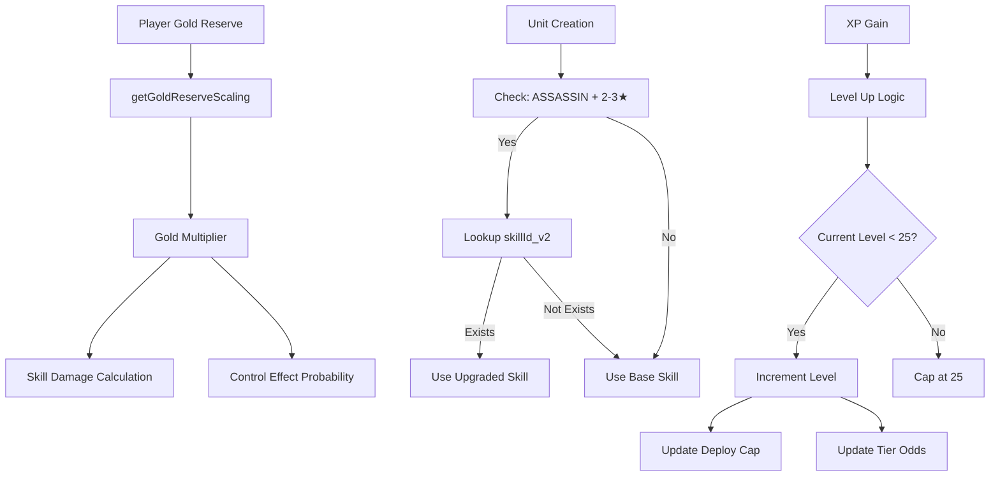
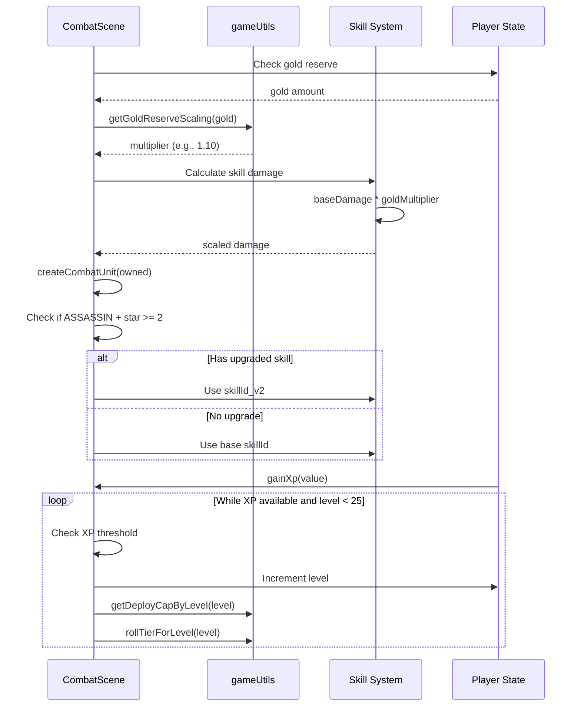

# Design Document: Gold Scaling and Level Cap

## Overview

This feature introduces three interconnected game mechanics to enhance late-game progression: (1) a gold reserve scaling system that amplifies skill damage and control effects based on accumulated gold, (2) an assassin skill upgrade system that automatically uses enhanced "_v2" variants for 2-3 star assassins, and (3) an increased level cap from 9-12 to 25 across all game scenes. These mechanics work together to reward economic management, provide meaningful star upgrades for assassins, and extend the progression curve for longer gameplay sessions.

## Architecture



## Main Workflow



## Components and Interfaces

### Component 1: Gold Reserve Scaling System

**Purpose**: Calculate damage and effect multipliers based on player's accumulated gold to reward economic management.

**Interface**:
```javascript
/**
 * Calculate gold reserve scaling multiplier
 * @param {number} gold - Current gold amount
 * @returns {number} Multiplier (1.0 = no bonus, 1.10 = +10% bonus)
 */
function getGoldReserveScaling(gold) {
  // Implementation in gameUtils.js
}
```

**Responsibilities**:
- Calculate scaling multiplier based on gold threshold (10 gold baseline)
- Apply +1% power per 2 gold above threshold
- Return multiplier for use in damage and effect calculations
- Cap multiplier at reasonable maximum (e.g., 2.0 for 100% bonus)

**Integration Points**:
- Called during skill damage calculation in CombatScene
- Applied to control effect probabilities (stun, freeze, sleep, etc.)
- Affects both physical and magical damage skills

### Component 2: Assassin Skill Upgrade System

**Purpose**: Automatically upgrade assassin skills to "_v2" variants when unit reaches 2-3 stars.

**Interface**:
```javascript
/**
 * Get appropriate skill ID for unit based on star level
 * @param {string} baseSkillId - Base skill ID from unit definition
 * @param {string} classType - Unit class (ASSASSIN, MAGE, etc.)
 * @param {number} star - Star level (1-3)
 * @returns {string} Skill ID to use (may be upgraded variant)
 */
function getEffectiveSkillId(baseSkillId, classType, star) {
  // Implementation in CombatScene.js or gameUtils.js
}
```

**Responsibilities**:
- Check if unit is ASSASSIN class with 2-3 stars
- Look up `${baseSkillId}_v2` in SKILL_LIBRARY
- Return upgraded skill ID if exists, otherwise return base skill ID
- Ensure backward compatibility for units without upgrades

**Affected Skills** (from skills.csv analysis):
- `void_execute` → `void_execute_v2` (rage refund on kill)
- `flame_combo` → `flame_combo_v2` (gold reward on kill)
- `mosquito_drain` → `mosquito_drain_v2` (max HP increase)

### Component 3: Level Cap Extension

**Purpose**: Allow players to level up to 25 instead of current caps (9 in Combat/Board, 12 in Planning).

**Interface**:
```javascript
/**
 * Gain experience and level up if threshold reached
 * @param {number} value - XP amount to gain
 */
function gainXp(value) {
  // Updated in CombatScene.js, PlanningScene.js, BoardPrototypeScene.js
}
```

**Responsibilities**:
- Process XP gains and trigger level ups
- Cap maximum level at 25 (changed from 9 or 12)
- Update player state (level, xp)
- Log level up events
- Trigger deploy cap and tier odds updates

**Supporting Functions** (already support level 25):
- `getDeployCapByLevel(level)` - Returns deploy slots (3 to 25)
- `rollTierForLevel(level)` - Returns tier based on odds table
- `getXpToLevelUp(level)` - Returns XP needed for next level

## Data Models

### Gold Scaling Configuration

```javascript
const GOLD_SCALING_CONFIG = {
  baselineGold: 10,        // Gold amount with no bonus
  goldPerPercent: 2,       // Gold needed for +1% bonus
  maxMultiplier: 2.0       // Cap at +100% bonus (200 gold)
};
```

**Validation Rules**:
- `baselineGold` must be >= 0
- `goldPerPercent` must be > 0
- `maxMultiplier` must be >= 1.0

### Skill Upgrade Mapping

```javascript
const ASSASSIN_SKILL_UPGRADES = {
  'void_execute': 'void_execute_v2',
  'flame_combo': 'flame_combo_v2',
  'mosquito_drain': 'mosquito_drain_v2'
};
```

**Validation Rules**:
- Base skill ID must exist in SKILL_LIBRARY
- Upgraded skill ID must exist in SKILL_LIBRARY
- Only applies to ASSASSIN class units
- Only applies to 2-3 star units

### Level Cap Configuration

```javascript
const LEVEL_CAP = 25;  // Updated from 9 or 12
```

**Validation Rules**:
- Must match maximum level in `XP_TO_LEVEL_UP` table
- Must match maximum level in `TIER_ODDS_BY_LEVEL` table
- Must be >= current level caps to avoid breaking saves

## Algorithmic Pseudocode

### Gold Reserve Scaling Algorithm

```javascript
/**
 * Calculate gold reserve scaling multiplier
 * 
 * Preconditions:
 * - gold >= 0
 * - GOLD_SCALING_CONFIG is properly initialized
 * 
 * Postconditions:
 * - Returns multiplier >= 1.0
 * - Returns multiplier <= maxMultiplier
 * - Multiplier increases linearly with gold above baseline
 */
function getGoldReserveScaling(gold) {
  // Step 1: Handle edge case - gold below baseline
  if (gold <= GOLD_SCALING_CONFIG.baselineGold) {
    return 1.0;  // No bonus
  }
  
  // Step 2: Calculate gold above baseline
  const excessGold = gold - GOLD_SCALING_CONFIG.baselineGold;
  
  // Step 3: Calculate bonus percentage (+1% per 2 gold)
  const bonusPercent = excessGold / GOLD_SCALING_CONFIG.goldPerPercent;
  
  // Step 4: Convert to multiplier (1.0 + bonus as decimal)
  const multiplier = 1.0 + (bonusPercent / 100);
  
  // Step 5: Apply cap to prevent excessive scaling
  return Math.min(multiplier, GOLD_SCALING_CONFIG.maxMultiplier);
}
```

**Loop Invariants**: N/A (no loops)

**Examples**:
- `getGoldReserveScaling(10)` → 1.0 (baseline, no bonus)
- `getGoldReserveScaling(30)` → 1.10 (+10% for 20 excess gold)
- `getGoldReserveScaling(50)` → 1.20 (+20% for 40 excess gold)
- `getGoldReserveScaling(210)` → 2.0 (capped at +100%)

### Assassin Skill Upgrade Algorithm

```javascript
/**
 * Get effective skill ID with upgrade logic
 * 
 * Preconditions:
 * - baseSkillId is non-empty string
 * - classType is valid class enum
 * - star is integer 1-3
 * - SKILL_LIBRARY is loaded
 * 
 * Postconditions:
 * - Returns valid skill ID that exists in SKILL_LIBRARY
 * - Returns upgraded variant only if all conditions met
 * - Never returns null or undefined
 */
function getEffectiveSkillId(baseSkillId, classType, star) {
  // Step 1: Check if unit qualifies for upgrade
  if (classType !== 'ASSASSIN' || star < 2) {
    return baseSkillId;  // Not eligible
  }
  
  // Step 2: Construct upgraded skill ID
  const upgradedSkillId = `${baseSkillId}_v2`;
  
  // Step 3: Check if upgraded skill exists in library
  if (SKILL_LIBRARY[upgradedSkillId]) {
    return upgradedSkillId;  // Use upgrade
  }
  
  // Step 4: Fall back to base skill
  return baseSkillId;
}
```

**Loop Invariants**: N/A (no loops)

**Examples**:
- `getEffectiveSkillId('void_execute', 'ASSASSIN', 3)` → `'void_execute_v2'`
- `getEffectiveSkillId('void_execute', 'ASSASSIN', 1)` → `'void_execute'` (1 star)
- `getEffectiveSkillId('void_execute', 'MAGE', 3)` → `'void_execute'` (not assassin)
- `getEffectiveSkillId('blood_bite', 'ASSASSIN', 2)` → `'blood_bite'` (no _v2 exists)

### Level Up Algorithm

```javascript
/**
 * Process XP gain and level up
 * 
 * Preconditions:
 * - value >= 0
 * - this.player.level >= 1
 * - this.player.xp >= 0
 * - XP_TO_LEVEL_UP table is loaded
 * 
 * Postconditions:
 * - Player level <= LEVEL_CAP (25)
 * - Remaining XP stored in this.player.xp
 * - Level up logs generated for each level gained
 * 
 * Loop Invariants:
 * - amount >= 0 throughout loop
 * - this.player.level <= LEVEL_CAP
 * - XP properly distributed between levels
 */
function gainXp(value) {
  let amount = value;
  
  // Process XP while available and not at cap
  while (amount > 0 && this.player.level < LEVEL_CAP) {
    // Calculate XP needed for next level
    const need = getXpToLevelUp(this.player.level) - this.player.xp;
    
    if (amount >= need) {
      // Enough XP to level up
      amount -= need;
      this.player.level += 1;
      this.player.xp = 0;
      this.addLog(`Lên cấp ${this.player.level}.`);
    } else {
      // Not enough XP, add to current progress
      this.player.xp += amount;
      amount = 0;
    }
  }
  
  // Any remaining XP is discarded if at level cap
}
```

**Loop Invariants**:
- `amount >= 0` (never negative)
- `this.player.level <= LEVEL_CAP` (never exceeds 25)
- `this.player.xp < getXpToLevelUp(this.player.level)` (XP resets on level up)

**Examples**:
- Level 8 with 50 XP, gain 10 XP → Level 9 (threshold is 52)
- Level 24 with 780 XP, gain 20 XP → Level 25 (threshold is 788)
- Level 25 with any XP, gain any XP → Stays level 25 (capped)

### Skill Damage Scaling with Gold

```javascript
/**
 * Calculate skill damage with gold scaling applied
 * 
 * Preconditions:
 * - baseDamage >= 0
 * - this.player.gold >= 0
 * 
 * Postconditions:
 * - Returns damage >= baseDamage (never reduces damage)
 * - Damage scales linearly with gold multiplier
 */
function calculateSkillDamage(baseDamage) {
  // Step 1: Get gold scaling multiplier
  const goldMultiplier = getGoldReserveScaling(this.player.gold);
  
  // Step 2: Apply multiplier to base damage
  const scaledDamage = Math.round(baseDamage * goldMultiplier);
  
  return scaledDamage;
}
```

### Control Effect Probability Scaling with Gold

```javascript
/**
 * Calculate control effect probability with gold scaling
 * 
 * Preconditions:
 * - baseChance is between 0.0 and 1.0
 * - this.player.gold >= 0
 * 
 * Postconditions:
 * - Returns probability between 0.0 and 1.0 (capped)
 * - Probability >= baseChance (never reduces)
 */
function calculateEffectChance(baseChance) {
  // Step 1: Get gold scaling multiplier
  const goldMultiplier = getGoldReserveScaling(this.player.gold);
  
  // Step 2: Apply multiplier to base chance
  const scaledChance = baseChance * goldMultiplier;
  
  // Step 3: Cap at 100% (1.0)
  return Math.min(scaledChance, 1.0);
}
```

## Key Functions with Formal Specifications

### Function 1: getGoldReserveScaling()

```javascript
export function getGoldReserveScaling(gold) {
  const baselineGold = 10;
  const goldPerPercent = 2;
  const maxMultiplier = 2.0;
  
  if (gold <= baselineGold) {
    return 1.0;
  }
  
  const excessGold = gold - baselineGold;
  const bonusPercent = excessGold / goldPerPercent;
  const multiplier = 1.0 + (bonusPercent / 100);
  
  return Math.min(multiplier, maxMultiplier);
}
```

**Preconditions:**
- `gold` is a non-negative number
- Function is called with valid numeric input

**Postconditions:**
- Returns a number between 1.0 and 2.0 (inclusive)
- Return value is 1.0 when gold <= 10
- Return value increases linearly with gold above 10
- Return value is capped at 2.0 (maxMultiplier)

**Loop Invariants:** N/A (no loops)

### Function 2: getEffectiveSkillId()

```javascript
function getEffectiveSkillId(baseSkillId, classType, star) {
  if (classType !== 'ASSASSIN' || star < 2) {
    return baseSkillId;
  }
  
  const upgradedSkillId = `${baseSkillId}_v2`;
  
  if (SKILL_LIBRARY[upgradedSkillId]) {
    return upgradedSkillId;
  }
  
  return baseSkillId;
}
```

**Preconditions:**
- `baseSkillId` is a non-empty string
- `classType` is a valid class type string
- `star` is an integer between 1 and 3
- `SKILL_LIBRARY` is loaded and accessible

**Postconditions:**
- Returns a valid skill ID string
- Returns upgraded variant only if: classType === 'ASSASSIN' AND star >= 2 AND upgraded skill exists
- Always returns a skill ID that exists in SKILL_LIBRARY
- Never returns null or undefined

**Loop Invariants:** N/A (no loops)

### Function 3: gainXp()

```javascript
function gainXp(value) {
  let amount = value;
  while (amount > 0 && this.player.level < 25) {
    const need = getXpToLevelUp(this.player.level) - this.player.xp;
    if (amount >= need) {
      amount -= need;
      this.player.level += 1;
      this.player.xp = 0;
      this.addLog(`Lên cấp ${this.player.level}.`);
    } else {
      this.player.xp += amount;
      amount = 0;
    }
  }
}
```

**Preconditions:**
- `value` is a non-negative number
- `this.player.level` is between 1 and 25
- `this.player.xp` is non-negative
- `getXpToLevelUp()` function is available

**Postconditions:**
- `this.player.level` is between 1 and 25 (capped)
- `this.player.xp` is non-negative
- All available XP is consumed or player reaches level 25
- Log entries created for each level gained

**Loop Invariants:**
- `amount >= 0` throughout loop execution
- `this.player.level <= 25` throughout loop execution
- `this.player.xp >= 0` throughout loop execution
- Each iteration either levels up or adds remaining XP

## Example Usage

### Example 1: Gold Scaling in Combat

```javascript
// In CombatScene.js - during skill damage calculation
const baseDamage = 100;
const goldMultiplier = getGoldReserveScaling(this.player.gold);
const finalDamage = Math.round(baseDamage * goldMultiplier);

// With 10 gold: finalDamage = 100 (no bonus)
// With 30 gold: finalDamage = 110 (+10% bonus)
// With 50 gold: finalDamage = 120 (+20% bonus)
```

### Example 2: Assassin Skill Upgrade

```javascript
// In CombatScene.js - createCombatUnit()
const base = UNIT_BY_ID[owned.baseId];
const star = owned.star;

// Get effective skill ID (may be upgraded)
const effectiveSkillId = getEffectiveSkillId(
  base.skillId,
  base.classType,
  star
);

// Use the effective skill ID
const unit = {
  // ... other properties
  skillId: effectiveSkillId,
  // ... rest of unit
};

// Example: Panther (void_execute) at 3★ → uses void_execute_v2
// Example: Fox (flame_combo) at 2★ → uses flame_combo_v2
// Example: Bat (blood_bite) at 2★ → uses blood_bite (no _v2 exists)
```

### Example 3: Level Up to 25

```javascript
// In any scene with gainXp()
this.player.level = 24;
this.player.xp = 780;

// Gain 20 XP (threshold is 788)
this.gainXp(20);

// Result: level = 25, xp = 12
// Log: "Lên cấp 25."

// Try to gain more XP
this.gainXp(100);

// Result: level = 25, xp = 12 (unchanged, at cap)
```

### Example 4: Control Effect Scaling

```javascript
// In CombatScene.js - applying stun effect
const baseStunChance = 0.40;  // 40% base chance
const goldMultiplier = getGoldReserveScaling(this.player.gold);
const effectiveChance = Math.min(baseStunChance * goldMultiplier, 1.0);

// With 10 gold: effectiveChance = 0.40 (40%)
// With 30 gold: effectiveChance = 0.44 (44%)
// With 50 gold: effectiveChance = 0.48 (48%)
// With 150 gold: effectiveChance = 0.60 (60%)
```

## Correctness Properties

*A property is a characteristic or behavior that should hold true across all valid executions of a system—essentially, a formal statement about what the system should do. Properties serve as the bridge between human-readable specifications and machine-verifiable correctness guarantees.*

### Property 1: Gold Scaling Monotonicity

*For any* two gold amounts g1 and g2 where g1 < g2, the gold multiplier for g1 should be less than or equal to the gold multiplier for g2.

**Validates: Requirements 1.4**

### Property 2: Gold Scaling Bounds

*For any* gold amount, the gold multiplier should be between 1.0 and 2.0 inclusive.

**Validates: Requirements 1.5**

### Property 3: Gold Scaling Formula

*For any* gold amount above 10, the gold multiplier should equal 1.0 + ((gold - 10) / 2) / 100, capped at 2.0.

**Validates: Requirements 1.2, 1.3**

### Property 4: Damage Scaling Correctness

*For any* base damage value and gold amount, the final damage should equal the base damage multiplied by the gold multiplier (rounded), and should never be less than the base damage.

**Validates: Requirements 2.2, 2.3**

### Property 5: Probability Scaling Correctness

*For any* base probability and gold amount, the final probability should equal the base probability multiplied by the gold multiplier (capped at 1.0), and should never be less than the base probability.

**Validates: Requirements 3.2, 3.4**

### Property 6: Assassin Skill Selection

*For any* unit, if the unit is an ASSASSIN with star level 2 or 3 and an upgraded skill exists in the Skill_Library, then the effective skill ID should be the upgraded variant; otherwise, it should be the base skill ID.

**Validates: Requirements 4.2, 4.3, 4.4, 4.5**

### Property 7: Skill Upgrade Naming Convention

*For any* base skill ID, the upgraded skill ID should be constructed as "${baseSkillId}_v2".

**Validates: Requirements 5.1, 5.2**

### Property 8: Level Cap Enforcement

*For any* XP gain at any level, after processing the XP, the player level should never exceed 25.

**Validates: Requirements 6.1, 6.2, 6.3**

### Property 9: XP Processing Correctness

*For any* XP gain when player level is below 25, the XP should be properly distributed across level ups with excess XP carried over, and each level up should increment the level by exactly 1.

**Validates: Requirements 7.1, 7.2, 7.3, 7.4**

### Property 10: Multi-Level Logging

*For any* XP gain that causes multiple level ups, a log message should be generated for each level gained.

**Validates: Requirements 8.2**

### Property 11: Level-Based Calculations Support

*For any* level from 1 to 25, the deploy cap calculation and tier odds calculation should return valid values.

**Validates: Requirements 9.3, 9.4**

### Property 12: Save Data Level Validation

*For any* loaded save data, if the level is above 25, it should be capped at 25; if the level is between 1 and 25, it should be preserved.

**Validates: Requirements 10.4**

### Property 13: XP Conservation

*For any* XP gain when player level is below 25, the total XP should be accounted for as either: (sum of XP thresholds crossed) + (final player.xp) + (XP discarded at level cap).

**Validates: Requirements 13.3**

### Property 14: Skill Upgrade Validity

*For any* unit, the effective skill ID returned by the Assassin_Upgrade_System should always be a valid skill ID that exists in the Skill_Library.

**Validates: Requirements 12.3**

## Error Handling

### Error Scenario 1: Invalid Gold Amount

**Condition**: `getGoldReserveScaling()` called with negative or non-numeric gold
**Response**: Treat as 0 gold, return 1.0 multiplier
**Recovery**: Log warning, continue with no bonus

### Error Scenario 2: Missing Upgraded Skill

**Condition**: Assassin with 2-3 stars but `_v2` skill doesn't exist in SKILL_LIBRARY
**Response**: Fall back to base skill ID
**Recovery**: Unit functions normally with base skill, no error thrown

### Error Scenario 3: Level Cap Data Mismatch

**Condition**: `XP_TO_LEVEL_UP` or `TIER_ODDS_BY_LEVEL` missing data for levels up to 25
**Response**: `getXpToLevelUp()` returns `Number.POSITIVE_INFINITY`, preventing further level ups
**Recovery**: Player caps at highest level with data, game continues

### Error Scenario 4: XP Overflow

**Condition**: Player gains massive XP amount (e.g., 10000 XP at once)
**Response**: Loop processes all XP, leveling up multiple times until cap
**Recovery**: Normal operation, all XP consumed or capped at level 25

## Testing Strategy

### Unit Testing Approach

Test each component in isolation with comprehensive edge cases:

**Gold Scaling Tests**:
- Test baseline (10 gold) returns 1.0
- Test linear scaling (30 gold = 1.10, 50 gold = 1.20)
- Test cap enforcement (210+ gold = 2.0)
- Test negative/zero gold handling
- Test fractional gold amounts

**Assassin Upgrade Tests**:
- Test ASSASSIN + 2★ with existing _v2 → returns upgraded
- Test ASSASSIN + 3★ with existing _v2 → returns upgraded
- Test ASSASSIN + 1★ → returns base skill
- Test non-ASSASSIN + 3★ → returns base skill
- Test ASSASSIN + 2★ with no _v2 → returns base skill

**Level Cap Tests**:
- Test level up from 8 to 9 (old cap)
- Test level up from 11 to 12 (old Planning cap)
- Test level up from 12 to 13 (breaking old cap)
- Test level up from 24 to 25 (new cap)
- Test XP gain at level 25 (no level up)
- Test massive XP gain (multiple levels at once)

### Property-Based Testing Approach

Use property-based testing to verify invariants across random inputs:

**Property Test Library**: fast-check (JavaScript)

**Test Properties**:
1. Gold scaling monotonicity: `∀ g1, g2: g1 < g2 ⟹ scale(g1) ≤ scale(g2)`
2. Gold scaling bounds: `∀ g: 1.0 ≤ scale(g) ≤ 2.0`
3. Level cap enforcement: `∀ xp, level: gainXp(xp) ⟹ level ≤ 25`
4. XP conservation: `∀ xp: totalXpUsed + remainingXp = xp`
5. Skill upgrade idempotence: `∀ unit: getSkill(getSkill(unit)) = getSkill(unit)`

### Integration Testing Approach

Test interactions between components in realistic game scenarios:

**Combat Integration Tests**:
- Create combat with 30 gold, verify damage is 10% higher
- Create 2★ assassin, verify _v2 skill is used
- Level up from 24 to 25 in combat, verify cap works
- Combine gold scaling + assassin upgrade in same combat

**Cross-Scene Tests**:
- Level up to 25 in CombatScene, verify state persists
- Level up to 25 in PlanningScene, verify state persists
- Level up to 25 in BoardPrototypeScene, verify state persists
- Verify deploy cap updates correctly at level 25

**Save/Load Tests**:
- Save game at level 25, reload, verify level preserved
- Save game with 50 gold, reload, verify gold scaling works
- Save game with 2★ assassin, reload, verify skill upgrade works

## Performance Considerations

**Gold Scaling Performance**:
- `getGoldReserveScaling()` is O(1) constant time
- Called once per skill activation (acceptable overhead)
- No caching needed due to simplicity

**Assassin Upgrade Performance**:
- `getEffectiveSkillId()` is O(1) constant time
- Called once per unit creation (acceptable overhead)
- Skill lookup in SKILL_LIBRARY is O(1) hash table access

**Level Cap Performance**:
- `gainXp()` loop complexity is O(n) where n = levels gained
- Typically n = 1 (single level up), worst case n = 25 (level 1 to 25)
- Acceptable performance for infrequent operation

**Memory Impact**:
- Gold scaling adds no persistent data (pure function)
- Assassin upgrades add no data (uses existing skill system)
- Level cap extends existing XP tables (already in memory)
- Total memory impact: negligible

## Security Considerations

**Gold Manipulation**:
- Gold scaling reads from player state, doesn't modify it
- Prevent client-side gold manipulation through validation
- Server-side validation recommended for multiplayer

**Skill ID Injection**:
- Skill upgrade logic only uses predefined mappings
- No user input in skill ID construction
- SKILL_LIBRARY lookup validates skill existence

**Level Cap Bypass**:
- Hard cap at 25 enforced in all scenes
- No way to exceed cap through XP overflow
- Save data validation should check level <= 25

## Dependencies

**Internal Dependencies**:
- `gameUtils.js`: Core utility functions, XP tables, tier odds
- `CombatScene.js`: Combat logic, unit creation, skill execution
- `PlanningScene.js`: Planning phase, XP gain, level up
- `BoardPrototypeScene.js`: Board prototype, XP gain, level up
- `unitCatalog.js`: Unit definitions, UNIT_BY_ID lookup
- `skillLibrary.js`: Skill definitions, SKILL_LIBRARY lookup

**External Dependencies**:
- None (pure JavaScript, no external libraries needed)

**Data Dependencies**:
- `skills.csv`: Skill definitions including _v2 variants
- `units.csv`: Unit definitions with base skill IDs
- XP tables in gameUtils.js (already support level 25)
- Tier odds tables in gameUtils.js (already support level 25)

**Testing Dependencies**:
- Jest: Unit testing framework
- fast-check: Property-based testing library
- Test data: Sample units, skills, player states
