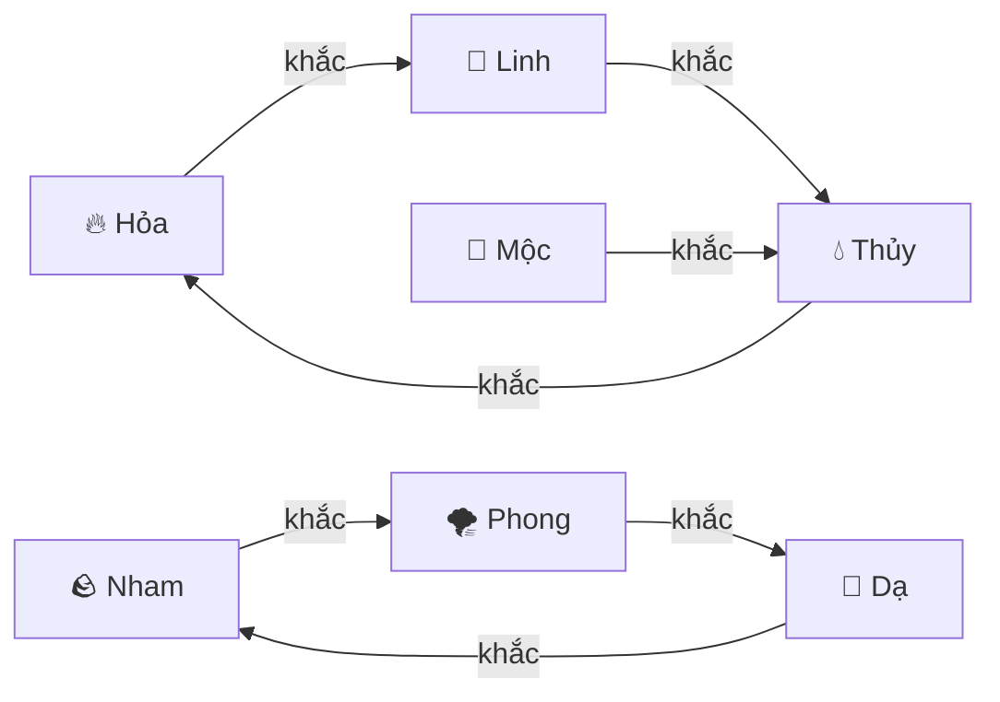

# 🌿 Hệ Thống Nguyên Tố, Tương Khắc & Hiệu Ứng

> Tài liệu mô tả đầy đủ cơ chế nguyên tố (tribe), tương khắc (counter), vai trò (class), và hiệu ứng trạng thái (status effects) trong game **Bá Chủ Khu Rừng**.

---

## 1. Nguyên Tố (Tribe / Element)

Mỗi linh thú thuộc 1 trong 8 nguyên tố. Nguyên tố quyết định hiệu ứng đặc trưng khi đánh thường và quy mô hiệu ứng theo cấp sao.

| Emoji | Nguyên tố | Key | Hiệu ứng đặc trưng | 1★ | 2★ | 3★ |
|:---:|---|---|---|---|---|---|
| 🔥 | **Hỏa** | `FIRE` | Cháy lan | 15% tỷ lệ | 25% tỷ lệ | 35% tỷ lệ |
| 💧 | **Thủy** | `TIDE` | Giảm né tránh | 15% giảm | 25% giảm | 35% giảm |
| 🌪️ | **Phong** | `WIND` | Giảm chính xác | 15% giảm | 25% giảm | 35% giảm |
| 🪨 | **Nham** | `STONE` | Giảm giáp | 20% giảm | 30% giảm | 40% giảm |
| 🌙 | **Dạ** | `NIGHT` | Chảy máu + giảm hồi | Chảy máu + -25% heal | Chảy máu mạnh + -25% | Nghiêm trọng + -25% |
| 🐝 | **Trùng** | `SWARM` | Nhiễm độc cộng dồn | +5%/đồng minh Trùng | +8%/đồng minh | +10%/đồng minh |
| 👻 | **Linh** | `SPIRIT` | Buff đặc biệt | Buff | Buff mạnh | Buff cực mạnh |
| 🌳 | **Mộc** | `WOOD` | Hút máu tự nhiên | Sinh mệnh | Sinh mệnh mạnh | Sinh mệnh cực mạnh |

> **File nguồn:** [elementInfo.js](file:///p:/DigiGO/games/game/src/data/elementInfo.js)

---

## 2. Tương Khắc Nguyên Tố (Tribe Counter)

Khi đơn vị tấn công mục tiêu có nguyên tố bị khắc → **+50% sát thương** (`COUNTER_BONUS = 0.50`).



### Bảng tương khắc nguyên tố

| Nguyên tố tấn công | Khắc | Nguyên tố mục tiêu | Bonus |
|:---:|:---:|:---:|:---:|
| 🔥 Hỏa | → | 👻 Linh | +50% |
| 👻 Linh | → | 💧 Thủy | +50% |
| 💧 Thủy | → | 🔥 Hỏa | +50% |
| 🪨 Nham | → | 🌪️ Phong | +50% |
| 🌪️ Phong | → | 🌙 Dạ | +50% |
| 🌙 Dạ | → | 🪨 Nham | +50% |
| 🌳 Mộc | → | 💧 Thủy | +50% |
| 🐝 Trùng | — | *(không khắc ai)* | — |

> [!NOTE]
> Có **2 vòng khắc chế tam giác**: Hỏa↔Linh↔Thủy và Nham↔Phong↔Dạ. Mộc khắc thêm Thủy. Trùng đứng ngoài vòng khắc.

---

## 3. Tương Khắc Vai Trò (Class Counter)

Ngoài nguyên tố, các **vai trò (class)** cũng có hệ khắc chế. Bonus giống nguyên tố: **+50% sát thương**.

| Vai trò tấn công | Khắc các vai trò |
|---|---|
| 🗡️ **Assassin** (Sát Thủ) | Mage, Archer |
| 🏹 **Archer** (Xạ Thủ) | Mage |
| ⚔️ **Fighter** (Chiến Binh) | Assassin |
| 🛡️ **Tanker** (Trọng Giáp) | *(không khắc ai)* |
| 🔮 **Mage** (Pháp Sư) | *(không khắc ai)* |
| 💚 **Support** (Hỗ Trợ) | *(không khắc ai)* |

> **File nguồn:** [synergies.js](file:///p:/DigiGO/games/game/src/data/synergies.js) (dòng 82–113)

---

## 4. Hiệu Ứng Trạng Thái (Status Effects)

Tất cả hiệu ứng được xử lý bởi `StatusEffectHandlers.js`. Mỗi hiệu ứng có **Apply** (áp dụng lần đầu) và **Tick** (xử lý mỗi lượt).

### 4.1 Khống Chế (Hard CC)

| Hiệu ứng | Mô tả | Cơ chế |
|---|---|---|
| ❄️ **Freeze** (Đóng băng) | Đơn vị không hành động | Giảm 1 lượt mỗi tick |
| ⚡ **Stun** (Choáng) | Đơn vị không hành động | Giảm 1 lượt mỗi tick |
| 😴 **Sleep** (Ngủ) | Đơn vị không hành động | Giảm 1 lượt mỗi tick |
| 🔇 **Silence** (Câm lặng) | Không thể dùng chiêu | Giảm 1 lượt mỗi tick |

### 4.2 Sát Thương Theo Lượt (DoT)

| Hiệu ứng | Mô tả | Cơ chế |
|---|---|---|
| 🔥 **Burn** (Cháy) | Gây damage/lượt | `burnDamage` mỗi tick, reset khi hết |
| ☠️ **Poison** (Nhiễm độc) | Gây damage/lượt | `poisonDamage` mỗi tick, reset khi hết |
| 🩸 **Bleed** (Chảy máu) | Gây damage/lượt | `bleedDamage` mỗi tick, reset khi hết |
| 🦠 **Disease** (Bệnh dịch) | Gây damage/lượt | `diseaseDamage` mỗi tick, reset khi hết |

### 4.3 Thay Đổi Chỉ Số (Stat Modifiers)

| Hiệu ứng | Loại | Mô tả |
|---|---|---|
| 🔨 **Armor Break** | Debuff | Giảm giáp mục tiêu |
| ⚔️ **ATK Buff** | Buff | Tăng sát thương vật lý |
| 📉 **ATK Debuff** | Debuff | Giảm sát thương vật lý |
| 🛡️ **DEF Buff** | Buff | Tăng phòng thủ vật lý |
| 🔮 **MDEF Buff** | Buff | Tăng kháng phép |
| 💨 **Evade Buff** | Buff | Tăng tỷ lệ né tránh |
| 🎯 **Evade Debuff** | Debuff | Giảm tỷ lệ né tránh |

### 4.4 Hiệu Ứng Đặc Biệt

| Hiệu ứng | Mô tả | Chi tiết |
|---|---|---|
| 🎯 **Taunt** (Khiêu khích) | Ép địch tấn công mình | Ghi `tauntTargetId` trên mục tiêu |
| 🪞 **Reflect** (Phản đòn) | Phản % sát thương bị nhận | `reflectPct` phản lại kẻ tấn công |
| ✋ **Disarm** (Tước vũ khí) | Không đánh thường được | Giảm 1 lượt mỗi tick |
| ✨ **Immune** (Miễn nhiễm) | Miễn hiệu ứng tiêu cực | Giảm 1 lượt mỗi tick |
| 🛡️ **PhysReflect** | Phản vật lý | Phản đòn sát thương vật lý |
| ⚔️ **Counter** (Phản công) | Đánh trả khi bị tấn công | Giảm 1 lượt mỗi tick |
| 🤝 **Protecting** (Bảo vệ) | Che chắn cho đồng minh | Giảm 1 lượt mỗi tick |

> **File nguồn:** [StatusEffectHandlers.js](file:///p:/DigiGO/games/game/src/systems/StatusEffectHandlers.js)

---

## 5. Cộng Hưởng (Synergy)

Khi có nhiều đơn vị cùng **vai trò** hoặc **nguyên tố** trên sân → kích hoạt bonus cộng hưởng theo threshold.

- **Class Synergy:** Đạt ngưỡng số lượng cùng class → buff team (ví dụ: 2 Tanker → +DEF, 4 Tanker → +DEF mạnh hơn)
- **Tribe Synergy:** Đạt ngưỡng số lượng cùng tribe → buff team (ví dụ: 2 Hỏa → burn on hit, 4 Hỏa → burn mạnh hơn)
- Dữ liệu synergy được parse từ `synergies.csv`

> **File nguồn:** [SynergySystem.js](file:///p:/DigiGO/games/game/src/systems/SynergySystem.js), [synergies.csv](file:///p:/DigiGO/games/game/data/synergies.csv)

---

## 6. Công Thức Sát Thương

Trong `CombatSystem.calculateDamage()`:

```
Sát thương = (ATK × hệ số skill) - DEF
           × (1 + counterBonus)     // +50% nếu khắc nguyên tố/vai trò
           × (1 + critBonus)        // nếu chí mạng
           × globalDamageMult       // nhân toàn cục
```

- **Sát thương vật lý:** dùng `ATK` vs `DEF`
- **Sát thương phép:** dùng `MATK` vs `MDEF`
- **Counter bonus:** +50% nếu nguyên tố hoặc vai trò khắc mục tiêu
- **Lifesteal:** hồi HP = `damage × lifestealPct`
- **Shield:** hấp thụ sát thương trước HP

> **File nguồn:** [CombatSystem.js](file:///p:/DigiGO/games/game/src/systems/CombatSystem.js) (hàm `calculateDamage`, dòng 251–404)

---

## 7. Bản Đồ File Tham Chiếu

| Chủ đề | File chính | Loại |
|---|---|---|
| Nguyên tố & hiệu ứng sao | `src/data/elementInfo.js` | Data |
| Tương khắc nguyên tố & vai trò | `src/data/synergies.js` | Data |
| Danh sách chiêu thức & tham số | `data/skills.csv` + `src/data/skills.js` | Data |
| Danh sách đơn vị (class, tribe) | `data/units.csv` + `src/data/unitCatalog.js` | Data |
| Cộng hưởng (threshold, bonus) | `data/synergies.csv` + `src/data/synergies.js` | Data |
| Xử lý hiệu ứng trạng thái | `src/systems/StatusEffectHandlers.js` | Logic |
| Tính sát thương & áp hiệu ứng | `src/systems/CombatSystem.js` | Logic |
| Tính & áp cộng hưởng | `src/systems/SynergySystem.js` | Logic |
| Biến thể skill theo class | `src/data/classSkillVariants.js` | Data |
| Pháp ấn (augment) | `src/data/augments.js` | Data |
| Vật phẩm & trang bị | `src/data/items.js` | Data |
